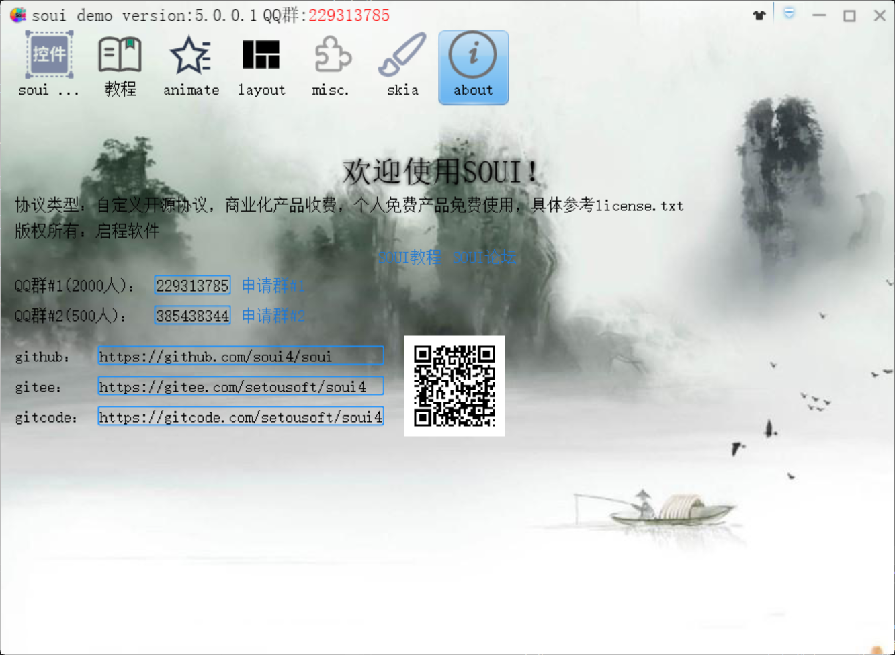
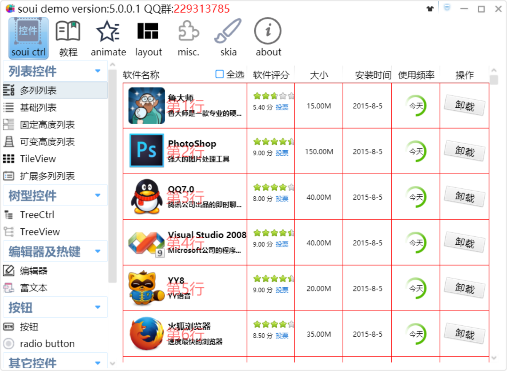

<div align= "center">

</div>


<div align= "center">
 <h1>SOUI 4</h1>

 <a>
    
 </a>
 <a href="https://github.com/soui4/soui/releases">
    
 </a>
<a href="https://github.com/soui4/soui/">
    
</a>

 <a href="https://2926295173.github.io/SoUIDocs">
    
</a>


</div>


 _SOUI4_ 是一套已经持续开发维护 **12年** 的轻量级Windows平台客户端开发框架,
（内核编译后体积1M左右），
框架设计吸收了`WTL`，`Android`，`QT`，`Flash`等流行框架的特点，
UI展示基于`xml`配置，性能高效（可选择GDI或[Skia](https://www.oschina.net/p/skia)渲染），
控件丰富，扩展灵活（可使用 _xml_ + _lua_ ），真正做到UI界面与逻辑分离。


##  **demo基本界面** 



如果您初次了解此库，可以下载自动化静态编译的[demo.exe](https://github.com/soui4/soui/actions)进行尝鲜体验（无需下载源代码和其他依赖，直接下载运行）
具体方法
[](https://github.com/soui4/soui/actions/workflows/cmaketest.yml)

```
1.点击上方图标,进入页面
2 随便点击一个绿色圆圈后面的链接进入
3 下拉界面，找到`Artifacts`栏
4 点击栏中的`PC_Demo`进行下载解压运行即可。
```
如您想自己编译更多的界面案例，请拉取 DEMO仓库：

- https://github.com/soui4-demo

每一个Demo一个单独的仓库，自己分别clone就好了。

如果想一次拉取所有demo,可以直接运行SOUI仓库代码下的`clone_demos.bat`来clone，当然前提是已经安装了git命令行工具。


##  **开始** 

使用SOUI需要一定的c++与win32的基础，请您确保您掌握了上述技能。

除本页说明外，您还可以查看更详细的[官方文档](https://2926295173.github.io/SoUIDocs/)

### Git下载地址

- [国外Git下载站点](https://github.com/soui4/soui)

- [国内Git下载站点](https://gitee.com/setoutsoft/soui4)(作为镜像使用)


### [编译](./doc/build.md)

[](https://github.com/soui4/soui/actions/workflows/cmaketest.yml)

如果为他vs2008编译，可以直接打开soui.08.sln来编译，包含了32位及64位两种配置。其它版本VS可以使用cmake生成对应版本VS工程再编译，运动在cmake中统一修改配置。具体编译方法查看附带[编译文档](./doc/build.md)

### UI可视化设计

`SOUI4 Editor`,仓库地址https://github.com/soui4-demo/SouiEditor
### SOUI4JS
`SOUI4的JavaScript导出版本，实现使用js开发客户端程序的框架，完美解决性能和灵活性的矛盾`,仓库地址(https://github.com/soui4/soui4js)

使用教程见文档

### 其他教程

- 阅读作者[博客](http://www.cnblogs.com/setoutsoft/)，能让你更快掌握如何使用SOUI快速开发Window桌面应用

- 作者录制的b站[视频教程](https://space.bilibili.com/110611388)

## 使用soui的软件展示

请点击[链接](https://2926295173.github.io/SoUIDocs/Show/show/)查看，持续更新

##  **QQ群** 

- SOUI讨论#1: [点击加入](http://shang.qq.com/wpa/qunwpa?idkey=9653a811a72365d798a5247d6ba6885a568bdcf51c624f906c8ce7b8fd9e4eda)

- SOUI讨论#2: [点击加入](http://shang.qq.com/wpa/qunwpa?idkey=03d3294a2551beb1b54b4012086cec14b3f66d5c253debaeed241d9c623966e0)

##  **LICENSE** 

请查看[`license.txt`](./license.txt)文档


##  **Linux编译** 
安装git, cmake
sudo apt-get install git cmake

安装build-essential,gdb,xcb,xcb-util,cairo.
sudo apt install build-essential gdb libcairo2-dev libxcb1-dev libxcb-util0-dev
安装完成后，即可编译。
要调试代码可以在linux系统上安装vscode，使用gdb进行调试

使用vs远程调试
linux机器上安装
sudo apt install -y openssh-server build-essential gdb rsync make zip ninja-build
本机安装
CMake, Vcxsvr(https://sourceforge.net/projects/vcxsrv/files/vcxsrv/21.1.10/vcxsrv-64.21.1.10.0.installer.exe/download)
在VS菜单：
工具\选项\跨平台 页面的列表中添加linux主机IP，注意配置好登陆启用名，密码
然后就可以在VS里运行远程调试了。
具体参考：https://learn.microsoft.com/zh-cn/cpp/build/get-started-linux-cmake?view=msvc-170