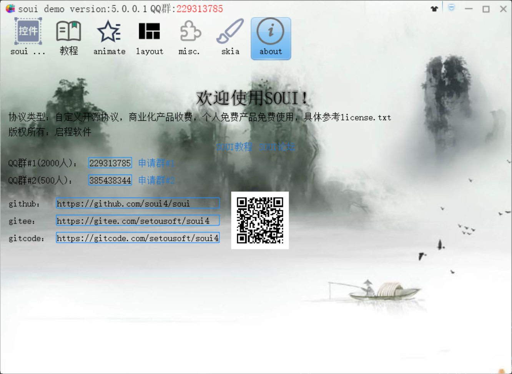
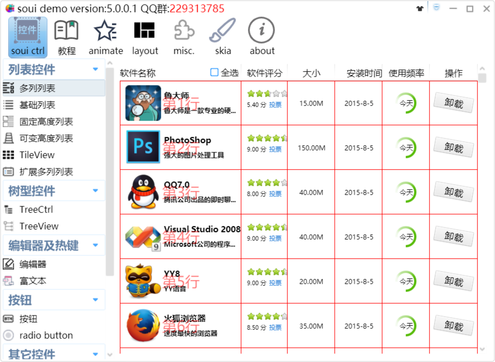

 <h1>SOUI 4</h1>

 
 

 

 

## Language Versions / 语言版本

This README is available in the following languages:
- [English Version (README.md)](README.md)
- [Chinese Version (README.zh-CN.md)](README.zh-CN.md)

---

## Guide

SOUI4 is a lightweight, **cross-platform** C++ DirectUI framework, continuously developed and maintained for **14 years**. The compiled core is about 2MB. The framework design draws inspiration from popular frameworks such as WTL, Android, QT, and Flash. UI presentation is based on XML configuration, with high performance (choose GDI or [Skia](https://www.oschina.net/p/skia) rendering), rich controls, and flexible extension (supports xml + lua + js), truly separating UI and logic.

Thanks to the built-in **swinx** layer — a framework that re-implements the Windows API (windows.h / winuser.h / gdi.h …) on non-Windows platforms — the **same C++ UI and business code** runs on Windows, Linux, macOS, iOS, Android and HarmonyOS (OHOS). Visit the [SOUI Official Website](https://www.soui.com.cn).

## Cross-Platform Support

SOUI4 covers six platforms through swinx:

| Platform | Status | Windowing / Launcher | 2D Backend |
| --- | --- | --- | --- |
| **Windows** | Native | System CRT / Win32 | GDI / Direct2D |
| **Linux** | Supported | xcb + `poll()` event loop | Cairo |
| **macOS** | Supported | `NSApplication` (`SwinXApplication`) | Core Graphics |
| **iOS** | Supported | `UIApplicationMain` (hosted by `swinx_ios_entry`) | Core Graphics |
| **Android** | Supported | JVM launcher, `PlatformAPI` bridge | Cairo |
| **HarmonyOS (OHOS)** | Supported | ArkTS runtime, `PlatformAPI` bridge | Cairo |

How swinx is layered per platform:

- **Windows** does not compile swinx — it uses the system Windows SDK directly.
- **Linux / macOS / iOS** implement their platform APIs *inside* swinx and own their own message loop / launcher, so they need no extra bridge.
- **Android / HarmonyOS** are launched by the JVM / ArkTS runtime and have no launcher of their own; their platform bridges (`clipboard / window / ime / audio / path`) are filled into the C struct `PlatformAPI` and registered through `PlatformAPI_Init`.

The SOUI render factory (`Render_Gdi` / `Render_Skia` / `Render_D2d`) is uniform across platforms; cross-platform projects typically use **`Render_Skia`** + `ImgDecoder_Stb`. Mobile builds additionally provide `SModalView` (a modal-dialog implementation that replaces `SHostDialog`, since mobile runtimes cannot spin up their own message loop) and inertial **fling** scrolling on `SPanel`.

## Demo Screenshots

If you are new to SOUI, you can download the statically compiled [demo.exe](https://github.com/soui4/soui/actions) for a quick try (no need for source code or dependencies, just download and run).

Steps:
1. Click the badge above to enter the page
2. Click any link after the green circle
3. Scroll down to find the `Artifacts` section
4. Download and extract `PC_Demo` to run

For more demo cases, visit the DEMO repository:
- https://github.com/soui4-demo
Each demo is in a separate repository, clone as needed.

## Getting Started

SOUI requires basic knowledge of C++ and Win32. Please ensure you are familiar with these skills.
For more details, see the [official documentation](http://doc.soui.com.cn/).

### Git Repositories
- [GitHub](https://github.com/soui4/soui)
- [Gitee](https://gitee.com/setoutsoft/soui4)
- [GitCode](https://gitcode.com/setoutsoft/soui4)

### [Build Instructions](./doc/build.md)

Use CMake to generate Visual Studio projects, then compile. All configuration is managed in CMake. For details, see [build documentation](./doc/build.md).

### UI Visual Designer
The latest souieditor is integrated in the demos folder. Build the demo to get souieditor.

### SOUI4JS
- JavaScript export version for client development. Repository: [soui4js](https://github.com/soui4/soui4js)
- Supports Windows, Linux, macOS.

### SOUI4PY
- Python3 version for client development. Repository: [soui4py](https://gitee.com/setoutsoft/soui4py)
- Supports Windows, Linux, macOS.

### Tutorials
- Latest [Online Tutorial](http://doc.soui.com.cn) (most complete, updated regularly)
- [Tutorial Source Code](https://gitee.com/setoutsoft/soui-docs) (host locally with http server)
- Author's [Blog](http://www.cnblogs.com/setoutsoft/)
- Author's Bilibili [Video Tutorials](https://space.bilibili.com/110611388)

## QQ Groups
- SOUI Discussion #1: [Join](http://shang.qq.com/wpa/qunwpa?idkey=9653a811a72365d798a5247d6ba6885a568bdcf51c624f906c8ce7b8fd9e4eda)
- SOUI Discussion #2: [Join](http://shang.qq.com/wpa/qunwpa?idkey=03d3294a2551beb1b54b4012086cec14b3f66d5c253debaeed241d9c623966e0)

## Build Instructions
### Windows
- Use CMake to generate project files, open with Visual Studio, and compile
- Or use mingw32/64: `mkdir build && cd build && cmake .. && make -j8`

### Linux
- Pull submodule swinx: `git submodule update --init`
- Install dependencies: `sudo apt install cmake git build-essential gdb libxcb1-dev libgl1-mesa-dev freeglut3-dev`
- Build: `mkdir build && cd build && cmake .. && make -j8`

### macOS
- Pull submodule swinx: `git submodule update --init`
- Install Homebrew ([China mirror](https://gitee.com/cunkai/HomebrewCN) recommended)
- Install homebrew-core and homebrew-cask: `brew tap homebrew/core && brew tap homebrew/cask`
- Install tools and dependencies: `brew install cmake ninja pkgconf glfw3 glew`
- Build: `mkdir build && cd build && cmake .. -G Ninja && ninja -j8`

### iOS
- Pull submodule swinx: `git submodule update --init`
- Generate an Xcode project and build with Xcode:
  `mkdir build && cd build && cmake .. -G Xcode -DCMAKE_SYSTEM_NAME=iOS`
- The app entry is hosted by `swinx_ios_entry()`, which wraps `UIApplicationMain`; the C++ `_tWinMain` is dispatched on the main thread after launch.

### HarmonyOS (OHOS)
- Requires the HarmonyOS SDK and DevEco Studio.
- The native layer lives under `entry/src/main/cpp`; UI resources are loaded directly from the HAP `rawfile` directory through `NativeResourceManager` (no copy to the sandbox).
- Build the OHOS module from DevEco Studio (or the `hvigor` CLI).

## Contributors
See [contributors.md](./contributors.md)

## License
See [`license.txt`](./license.txt)
