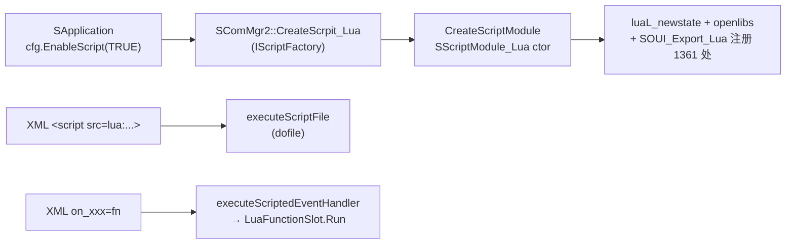
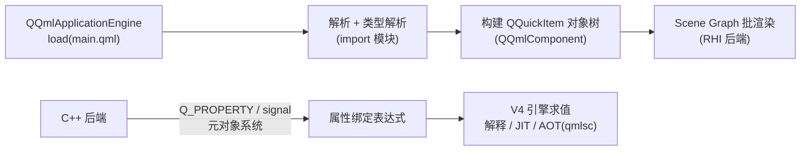

# SOUI Lua 脚本模块与 Qt QML 技术对比

> 基线：2026-10。SOUI 侧基于 `components/ScriptModule-LUA` 定稿版（Lua 5.4 + 定制 lua_tinker），
> 事实均对照本仓库源码与《ScriptModule-LUA导出技术与使用指南.md》；QML 侧基于 Qt 6 公开资料
> （V4 引擎、qmlcachegen/qmlsc/qmltc 工具链及官方基准数据）。
> 本文先界定对比对象，再从设计、实现、性能三个维度展开，最后给选型建议。

---

## 1. 先说清楚：对比的是什么

两者经常被放在一起讨论，但**不在同一层**：

| | SOUI + ScriptModule-LUA | Qt + QML |
| --- | --- | --- |
| 本质 | **命令式脚本桥**：保留 C++ UI 框架与 XML 声明式布局，把 SOUI 对象镜像进 Lua 虚拟机供逻辑层使用 | **全栈声明式 UI 语言**：QML 既是 UI 描述语言又是逻辑语言，自带渲染器（Scene Graph）与对象模型 |
| UI 描述 | XML（`uires/`，SWindow 树） | .qml 文件（QQuickItem 树） |
| 逻辑语言 | Lua 5.4（PUC-Lua 解释执行） | QML 声明式绑定 + JavaScript（V4 引擎，字节码解释 + JIT/AOT） |
| 渲染 | SOUI 自绘（GDI/D2D/Skia 等 Canvas 实现） | Qt Quick Scene Graph（RHI：D3D/Vulkan/Metal/OpenGL） |
| 脚本引擎与 UI 的关系 | 引擎是**可插拔外挂**（IScriptModule 接口，不装也能跑） | 引擎是**框架本体**（QQmlEngine 即 UI 运行时） |

所以公平的对比是：**"C++ UI 框架 + 外挂式 Lua 脚本" vs "以脚本语言为中心的原生 UI 栈"**。
前者脚本只做逻辑与数据驱动（推荐分工，见 demo 两个游戏）；后者脚本层连 UI 结构、属性、
动画、渲染节点全部接管。

---

## 2. 设计哲学对比

| 维度 | SOUI + Lua（ScriptModule-LUA） | Qt QML |
| --- | --- | --- |
| UI 与逻辑分离 | **强制分离**：UI 在 XML，逻辑在 lua；XML `on_xxx="函数名"` 是唯一缝合点 | **声明式融合**：UI 结构、属性绑定、逻辑函数写进同一个 .qml，鼓励"绑定优先" |
| 数据驱动 | 手动驱动：脚本调 `SetWindowText`/`SelectPage` 显式刷新（demo 的 LED 计数器、棋盘 SelectPage 循环） | 响应式：`text: "得分 " + score` 属性绑定，依赖变更自动重求值 |
| C++ 互操作面 | **显式白名单**：43 个导出头、约 1361 处类注册 + 109 个全局函数，未导出的 API lua 侧不存在（lua 绑定面窄，用前 grep `exp_*.h`） | **默认全暴露**：QObject 系派生类经元对象系统自动可访问；C++ 注册类型（QML_ELEMENT）+ Q_PROPERTY/INVOKABLE 声明面 |
| 对象所有权 | **多路径显式约定**（§4.3）：普通 push 不可释放 / 工厂产品脚本 Release / gcnew 归 GC，写错即泄漏或 UAF | **单一所有权模型**：QObject 父子树 + JS 侧 GC，QQuickItem 由 parent 链管理，多数情况无需手动释放 |
| 脚本崩溃的爆炸半径 | lua 错误默认经 pcall 边界（`executeScriptedEventHandler` → `call<bool>`），回调报错后不可信返回值；导出层裸指针语义错误（提前 Release/GC）直接 UAF | JS 异常被引擎捕获为 QML error（不崩进程）；但 QML 里 null 访问、绑定环等是运行时告警，类型错误多数在加载期拦截 |
| 热更新 | 脚本是资源（`uires.idx` `<lua><file>`），改脚本即可改逻辑（注意 demo 的 PE 资源嵌入需重编 rc） | 开发期热重载成熟（qml live reload）；发布形态可 qml 资源与二进制分离，同样支持不发版改 UI |

一句话总结：SOUI+Lua 是"**C++ 主权，脚本是客人**"——边界清晰、可控性强，但过桥的手续费
（导出面维护、生命周期纪律）由开发者支付；QML 是"**脚本主权，C++ 做后端**"——表达力强、
迭代快，但框架接管了一切，深层次定制要退回 C++ 写 QML 类型。

---

## 3. 架构与加载链

### 3.1 SOUI + Lua：三步加载，引擎可插拔

要点：

- 引擎经 **IScriptModule 五入口**接入（executeScriptFile / executeScriptBuffer /
  executeScriptedEventHandler / executeMain / getIdentifierString），换脚本语言
  （理论上换 Python/JS）不影响框架——这就是"外挂"的含义。
- 事件路由双向：XML→lua 走 LuaFunctionSlot（把函数名包成 IEvtSlot）；lua→C++ 走导出面
  （FindChildByNameA、CreateTimer、SubscribeEvent……）。
- 坐标/窗口模型不因脚本改变：`GetWindowRect2` 全树共享宿主坐标系、`Move/Move2` 立即生效、
  `pos` 属性等 relayout——脚本作者仍须懂 SOUI 的窗口模型。

### 3.2 QML：引擎即运行时

要点：

- QML 文档在加载期解析成**编译单元**：qmlcachegen（开源）构建期生成字节码缓存加速启动；
  qmlsc（商业版）把 JS 函数与绑定表达式 AOT 成 C++；qmltc（技术预览，Qt 6.8 仍如此）
  把 QML 类型整体编译为 C++ 类。
- 属性系统是骨架：Q_PROPERTY 的 notify 信号驱动绑定重求值，渲染节点按脏区更新。
- C++ 与 QML 的边界由元对象系统定义：注册类型、context property、模型（QAbstractItemModel）。

---

## 4. 实现技术对比

### 4.1 语言与引擎

| | Lua 5.4（PUC-Lua） | QML + JavaScript（V4） |
| --- | --- | --- |
| 范式 | 命令式、动态类型、单线程协程 | 声明式绑定 + 命令式 JS 函数 |
| 执行方式 | 纯解释执行字节码（SOUI 未启用 luajit） | 字节码解释；V4 内建 JIT（基线编译器）；AOT 可选 |
| 类型检查 | 无；绑定层 read 特化做隐式转换（如 nil→0） | 加载期结构校验 + qmllint 静态分析；绑定表达式类型可被 qmlsc 编译期检查 |
| 体积 | lua-54 静态库 + 绑定层，几百 KB 量级 | Qt QML 模块 + V4，数 MB 到数十 MB 量级（含 Qt Quick 全家桶） |
| 多线程 | 脚本在创建它的 UI 线程回调；SStringT 单线程约定，跨线程走 std::string | 引擎单线程渲染/求值（scene graph 渲染线程独立）；WorkerScript 提供 worker |

### 4.2 UI 与逻辑的分工（用 demo 的两个游戏说明）

SOUI 推荐分工是"XML 声明 UI，lua 驱动数据"：

- 跑马机：4 匹马、下注区、终点线全部 XML 静态声明，lua 只做 `on_timer` 里的
  `Move2` 定位与状态机——UI 结构变更不碰逻辑。
- 消消乐：棋盘格子由 lua 按 `t:g.xxl_ele` 模板动态创建（`CreateChildrenFromXml`），
  每格是 stack 翻页控件，`SelectPage` 换棋子；交换/消除/下沉走 SValueAnimator 动画组，
  组结束回调回 lua 提交数据。
- 连击提示（`txt_xxl_combo`）是普通文本控件，lua `SetWindowText` 刷新。

同样的消消乐用 QML 写：棋盘是 Repeater/Grid + model，棋子状态是 property int grid，
消除逻辑直接改 model，**所有显示靠绑定自动刷新**，动画靠 Behavior/Transition 声明。
对比之下：

| 环节 | SOUI+Lua 写法 | QML 写法 |
| --- | --- | --- |
| 建 8x8 棋盘 | lua 拼 XML 字符串 → CreateChildrenFromXml → 逐格 SelectPage | `Repeater { model: 64; delegate: Candy {} }` |
| 换棋子外观 | `QiIStackView(ele):SelectPage(state, true)` + 手动 Invalidate | `page: root.grid[y*8+x]`（属性绑定） |
| 移动动画 | SValueAnimator + 动画组 + 组结束回调提交 | `Behavior on x/y {}` 声明，改属性即动 |
| 浮层副本 | 手工管理 aniframe 副本窗口 + 全局唯一 id + 生命周期表（本仓库修过的三类 BUG 全在这） | Loader/Repeater 声明式创建，所有权归引擎 |

结论：**UI 结构与显示联动的复杂度，QML 的声明式模型有数量级优势**；SOUI+Lua 把这份复杂度
显式交给了开发者（也因此完全可控、无框架黑箱）。

### 4.3 对象生命周期（最容易踩坑的差异）

| | SOUI + Lua | QML |
| --- | --- | --- |
| 模型 | 按入栈路径分四类，纪律靠文档与用例约束（fun_test 27 用例逐类验证） | 统一所有权：QObject parent 树（视觉项归 item 树）+ JS GC（var 属性） |
| 典型规则 | `[GC]` gcnew 系 GC 自动 delete；`[Rel]` 工厂产品谁加载谁 Release（LoadAnimation/CreateTimer）；`[None]` 窗口树/单例绝不可 Release | C++ 返回 Q_INVOKABLE 的 QObject* 默认归 JS 所有权需小心；setParent 或 QQmlEngine::setObjectOwnership 显式声明 |
| 出错形态 | 提前 Release → UAF（MSVC Debug 0xDD 必崩，MinGW release 掩盖）；忘 Release → 泄漏（VLD 报告收口排查） | 悬挂引用多为 null + 告警而非崩溃；C++ 删 QML 引用对象时用 QPointer 防护 |
| 工程保障 | 生命周期三分法 + 每个导出对象一个"创建→使用→释放→GC"测试用例 | Ownership 文档化 + qmllint 提示 + 父子树自动析构兜底 |

SOUI 侧的纪律成本是真实的（见《lua模块升级记录与踩坑备忘.md》的泄漏/UAF 证据链），
但它换来的是**与 C++ 内存模型一一对应的可预测性**；QML 的所有权相对省心，但
"JS 持有 C++ 对象谁删谁"这类边界问题在复杂应用里同样需要设计。

### 4.4 工具链与开发体验

| | SOUI + Lua | QML |
| --- | --- | --- |
| IDE 支持 | 任意编辑器 + 手工 grep `exp_*.h` 查绑定面；无补全/跳转 | Qt Creator：补全、跳转、QM Design 模式；qmlls（LSP，Qt 6.3 起随 Qt Language Server 提供） |
| 静态检查 | 无（依赖 fun_test 运行时验证） | qmllint / qmlformat；qmlsc 编译期类型检查 |
| 构建期产物 | lua 源码直接进资源（可加密/嵌入 rc） | qmlcachegen 字节码缓存（开源）；qmlsc/qmltc（商业/预览） |
| 调试 | log4z slog 打点 + fun_test 探针；无交互式调试器 | QML Profiler（绑定求值/渲染/内存）、console.log、JS 调试器 |
| 热改脚本 | 改资源即改逻辑（需注意 demo 的 PE 资源嵌入陷阱：改 uires 后 touch demo.rc） | 开发期 live reload 成熟 |

### 4.5 导出/绑定面的维护成本

- SOUI：每导出一个类/方法都是显式代码（`class_def/class_mem/class_con` 等），demo 侧
  43 文件约 1470 处注册。x86 下还有 `UAPI` 强转陷阱（剥 __stdcall 导致 thunk 崩溃）。
  成本高，但**绑定面即安全面**——未导出的内部 API 脚本碰不到。
- QML：QObject 系自动暴露，写个 `Q_PROPERTY`/`Q_INVOKABLE` 即可用。成本低，但
  **面就是整个元对象系统**——版本升级、二进制兼容、脚本误用面都更大。

---

## 5. 性能对比

### 5.1 启动

| | SOUI + Lua | QML（Qt 6） |
| --- | --- | --- |
| 脚本启动成本 | `luaL_newstate + openlibs`（毫秒级）+ 一次性注册 1361 处类表 + dofile 脚本（demo 级脚本 <10ms）；Lua 解释器无 JIT 预热 | 解析 + 编译对象树是主要成本；无缓存冷启动显著。官方低端嵌入式实测（iMX6ULL，Coffee demo，100 次均值）：关闭编译器 683ms → qmlcachegen/qmlsc 428ms → qmltc 347ms |
| 缓解手段 | 脚本体积天然小；可延迟初始化非当前页逻辑 | qmlcachegen 字节码随二进制嵌入；AOT 进一步砍半 |

结论：**SOUI+Lua 的启动开销低一个量级**（纯解释器 + 小脚本）；QML 的启动成本靠 AOT
工具链收敛，重 UI 仍明显更重。

### 5.2 运行时逻辑

- **跨语言调用频率是 SOUI 侧的决定性因素**。每次 lua↔C++ 过桥都要经 userdata 元表查找、
  栈上参数转换、sobj_cast 等（如 `toSWindow(args:Sender())` → `QiIStackView(ele)`）。
  demo 的消消乐把"每帧"级调用（动画 tick）留在了 C++ 侧，lua 只在**组结束回调**里提交数据，
  就是为了把过桥次数压到每次交互常数次——这是实测有效的设计约束。
- Lua 5.4 纯解释执行，粗略参考：典型桌面 x64 上简单脚本逻辑 ~几十到上百 million 简单
  操作/秒量级，但**单次过桥成本通常比纯 lua 计算更贵**，优化方向是减少过桥而非抠 lua。
- QML 的 JS 在 V4 上有 JIT；官方数据（Qt 6.6/6.7 基准与 "Compiling QML to C++: 4x speedup"）
  显示把绑定/JS 函数 AOT 成 C++ 后绑定求值最高约 4x 提速——反过来说明**解释态绑定求值
  是 QML 运行时的主要热点之一**。高频数值计算两边的建议一致：下沉到 C++。
- 声明式绑定的隐藏成本：依赖追踪、自动重求值在复杂表达式链上会放大；SOUI 手动刷新
  模型没有这个问题，但漏刷新就是显示 BUG（消消乐"该消除的还在显示"一类）。

### 5.3 渲染（公平起见的说明）

脚本层不直接决定渲染性能：

- SOUI 自绘走 Canvas 实现（GDI/D2D/Skia）， Immediate 模型 + 脏区失效；脚本只是改属性
  触发 Invalidate。OLED/低端 GPU 设备上 2D 自绘反而轻量。
- Qt Quick Scene Graph 是批处理化 retained 渲染，动画多、item 多时优势明显，但引入
  GPU 驱动、着色器、RHI 抽象的固定开销。
- 因此**渲染性能对比本质是 SOUI 渲染后端与 Qt Quick 的对比，与脚本选型无关**——
  这正是"外挂脚本"设计的红利：换脚本引擎不影响渲染管线。

### 5.4 内存

| | SOUI + Lua | QML |
| --- | --- | --- |
| 引擎本体 | lua_State + 全局表 + 类表，百 KB 量级 | QQmlEngine + V4 + 已加载类型元信息，MB 到数十 MB 量级 |
| 对象包装 | 每个导出对象一个 userdata（几十字节 + 对象本体） | QObject/QQuickItem 本身有元对象开销（per-class，共享） |
| 可压缩性 | 高（不加载用不到的导出面则只有注册表代价） | 取决于 import 的模块集合 |

### 5.5 性能小结

| 场景 | 占优方 | 原因 |
| --- | --- | --- |
| 冷启动 / 低资源嵌入式 | SOUI+Lua | 解释器微内核、无 JIT 预热与类型系统开销 |
| 大量属性联动 / 动画密集 UI | QML | 声明式绑定 + scene graph 批渲染，AOT 后接近 C++ |
| 高频跨语言调用 | 平手（都该下沉 C++） | SOUI 过桥贵；QML 绑定求值解释态同样贵（AOT 提速 4x 反证） |
| 内存受限 | SOUI+Lua | 引擎足迹小一个量级 |
| UI 结构频繁变化的原型期 | QML | 声明式 + 热重载，迭代最快 |

---

## 6. 安全与健壮性

| | SOUI + Lua | QML |
| --- | --- | --- |
| 脚本错误的隔离 | pcall 边界 + 回调报错后不可信返回值（绑定层已加防护）；lua 沙箱能力强（可裁 openlibs） | JS 异常不崩进程；加载期校验大部分结构错误 |
| 内存安全风险面 | **大**：导出层裸指针 + 多路径所有权，纪律错误直接 UAF/双释放（本仓库 itimer UAF、动画包装 GC 悬挂都是实例）；MSVC Debug + VLD 是必备探测器 | 小：所有权归引擎，常见错误降级为 null/告警；主要风险在 C++ 与 QML 边界的所有权声明 |
| 类型安全 | 无（运行时隐式转换，错参可能静默 0） | qmlsc/qmllint 编译期检查可覆盖多数；运行期仍有 var 动态类型 |
| 可测试性 | fun_test 无头门禁（`^soui-headless$` 标签），27 用例覆盖每个导出对象生命周期，可进 CI | Qt Test/QQuickTest 可驱动 QML 组件，qmllint 进 CI |

---

## 7. 选型建议

| 你的情况 | 建议 |
| --- | --- |
| 已有成熟 SOUI C++ 工程，只想把业务逻辑/关卡/玩法外置热更 | **SOUI+Lua**：现有架构零迁移，导出面按需增长，体积与启动几乎免费 |
| 极端资源受限（嵌入式/工控）且 UI 相对静态 | **SOUI+Lua**（或纯 C++）：启动、内存、体积全面占优 |
| UI 交互复杂、动画密集、需要快速原型迭代 | **QML**：声明式绑定与动画系统是数量级的效率差异 |
| 跨平台桌面/移动全功能商业应用，有 Qt 预算 | **QML**：工具链（LSP/Profiler/AOT）成熟度高 |
| 对内存安全要求极高、团队 Lua 经验不足 | 慎用裸导出面模式；SOUI+Lua 需要配套"生命周期三分法 + 每对象用例"的工程纪律（本项目已具备） |
| 想兼得：SOUI 的轻量 + 声明式的显示联动 | 在 SOUI+Lua 内引入**属性-控件绑定表**（lua 侧 mini 响应式），demo 的 LED 计数器/棋盘 SelectPage 已是雏形；无需引入引擎级方案 |

---

## 8. 结语

- **ScriptModule-LUA 的定位是精确的**：给 C++ UI 框架加一个低开销、可控、可热更的逻辑层，
  不试图成为 UI 语言。它的一切设计（显式导出面、四条生命周期路径、事件槽桥接）都服务于
  "C++ 主权"。
- **QML 的定位也是精确的**：用声明式语言统一 UI 与逻辑，用编译器工具链补性能短板。
  它的强大伴随框架接管一切——体积、启动、所有权都交给 Qt。
- 两者性能差距最大的地方（启动、内存）恰是 SOUI+Lua 的设计目标所在；QML 占优的地方
  （声明式显示联动、动画、工具链）是 SOUI 可以在应用层局部借鉴（绑定表、模板化动态创建）
  而不必换引擎的。
- 工程纪律决定 SOUI+Lua 的下限：生命周期三分法、每个导出对象一个生命周期用例、
  MSVC Debug + VLD 双探测器——这套机制在本仓库已跑通并被 10 分钟人工局 + 90 秒自动化
  压力局验证。
