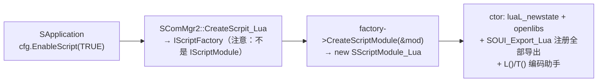
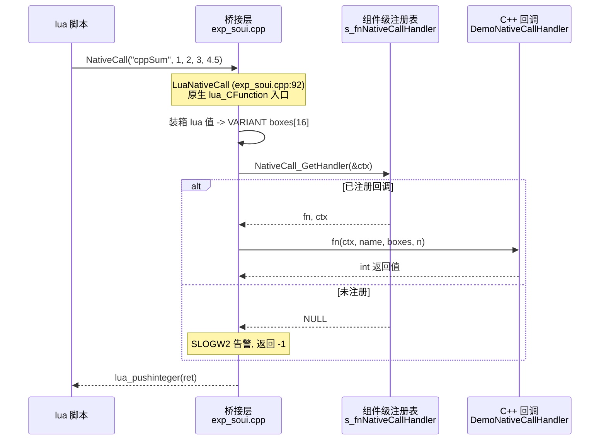

# ScriptModule-LUA 导出技术与使用指南

> 基线：2026-10 定稿版（Lua 5.4 + 定制版 lua_tinker）。
>
> 本文讲两件事：**这个模块把 SOUI 对象导出给 lua 的实现技术与注意事项**，以及
>
> **以 demo 内置的两个游戏（消消乐 / 跑马机）为例的使用方法**。
>
> 坑的完整证据链与排查过程见姊妹篇《lua模块升级记录与踩坑备忘.md》。
>
> 所有示例均可在 `demos/demo/uires/lua/test.lua`（跑马机 + 消消乐全部逻辑）与
>
> `demos/fun_test/test_lua.cpp`（27 个生命周期用例）中找到可运行原型。

---

## 1. 模块概览

### 1.1 组成

| 组成              | 位置                                         | 说明                                                                       |
| --------------- | ------------------------------------------ | ------------------------------------------------------------------------ |
| Lua 5.4         | `third-part/lua-54`                        | 静态编译进模块（含 VS2010 /Og clearkey 修复）                                        |
| lua_tinker（定制版） | `components/ScriptModule-LUA/lua_tinker/`  | 绑定层：userdata 包装、类注册、构造器、引用计数移交                                           |
| exports 导出面     | `components/ScriptModule-LUA/src/exports/` | 43 个文件、约 1470 处注册（类注册 1361 处 + 全局函数 109 个，其中 66 个为事件参数转换 `toStEventXxx`） |
| 脚本模块本体          | `src/ScriptModule-Lua.cpp`                 | `SScriptModule_Lua`：持有 `lua_State`，实现 IScriptModule                      |

### 1.2 加载链（运行时一次性的三步）



要点：

- `CreateScrpit_Lua` 返回的是 **IScriptFactory**（仅 4 个虚槽），直接当

  IScriptModule 用会虚表错位，必须两步创建（`ScriptModule-Lua.cpp:90` 起）。
- COM 侧 `SCreateInstance` 导出 `SIScriptFactory`（`ScriptModule-Lua.cpp` 末尾），

  静态 COM（COM_LIB=ON）与 DLL COM 两种链接方式下 SComMgr2 调用代码零差异。
- `SScriptModule_Lua` 构造时即完成全部注册；析构 `lua_close`，\*\*仍存活的

  userdata 会在 close 时逐一收到 `__gc`\*\*——这是测试用例能验证 GC 释放路径的依据。

### 1.3 IScriptModule 的五个入口

| 方法                            | 实现                        | 用途                                |
| ----------------------------- | ------------------------- | --------------------------------- |
| `executeScriptFile`           | `lua_tinker::dofile`      | 加载脚本资源文件                          |
| `executeScriptBuffer`         | `lua_tinker::dobuffer`    | 执行内存脚本（XML `<script>` CDATA、单测探针） |
| `executeScriptedEventHandler` | new LuaFunctionSlot → Run | XML `on_xxx="函数名"` 事件路由（见 §3.6）   |
| `executeMain`                 | `call<int>("main",...)`   | 可选脚本入口                            |
| `getIdentifierString`         | `"SOUI.Script.Lua5.4"`    | 标识                                |

---

## 2. 脚本接入 SOUI 程序的完整链路

以 demo 为例，四个接线点（缺一不可）：

| 步骤               | 文件                                     | 内容                                                           |
| ---------------- | -------------------------------------- | ------------------------------------------------------------ |
| ① C++ 启用脚本       | `demos/demo/demo.cpp:107`              | `cfg.EnableScript(TRUE)`（DLL_CORE/LIB_CORE+LIB_SOUI_COM 宏门控） |
| ② 脚本注册为资源        | `demos/demo/uires/uires.idx:172`       | `<lua><file name="lua_test" path="lua\test.lua" /></lua>`    |
| ③ XML 挂载脚本       | `demos/demo/uires/xml/dlg_main.xml:23` | `<script src="lua:lua_test">`；无 `src` 属性时从 CDATA 段加载         |
| ④ UI 事件指向 lua 函数 | `dlg_main.xml:69`                      | `<root on_init="on_init" on_exit="on_exit" ...>`             |

事件路由方向是双向的：

- **XML → lua**：`on_command="xxl_on_cmd"` 等属性，事件到达时 SOUI 调

  `executeScriptedEventHandler("xxl_on_cmd", pEvt)`，模块把函数名包成

  LuaFunctionSlot 并以 `IEvtArgs*` 为参数调用全局 lua 函数。
- **lua → C++**：脚本经导出面操作对象（FindChildByNameA、SetWindowText、

  CreateTimer……），或主动 `SubscribeEvent` 订阅事件（见 §4.3）；要给脚本

  导出一个新的 C++ 功能，还可走 `NativeCall` 零改动通道（见 §5）。

字符串编码助手（`ScriptModule-Lua.cpp` ctor 注册）：`L(str)`（UTF-8→UTF-16，

Windows）、`T(str)`（UTF-8→TCHAR）、`A2W/A2T`，非 Windows 平台 `L/T` 为直通。

---

## 3. 导出实现技术（lua_tinker 定制版）

### 3.1 userdata 包装类型与元表

lua_tinker 用一段 `lua_newuserdata` 内存包裹 C++ 对象，元表由

`class_add<T>` 注册（`__name/__index/__newindex/__gc/__call/__parent`）。

userdata 内嵌的包装结构决定 **GC 时对 C++ 对象做什么**：

| 包装结构          | 何时 new                   | `__gc`（destroyer）动作 | 典型用途                                             |
| ------------- | ------------------------ | ------------------- | ------------------------------------------------ |
| `val2user<T>` | 入栈时 placement-new（T 在堆上） | `delete T`          | `class_con` 构造、`push_gcnew`、`constructor_lstate` |
| `ptr2user<T>` | 只存指针，不拥有                 | **什么都不做**           | 普通对象 push（单例、宿主、非托管指针）                           |

`destroyer<T>`（`lua_tinker.h` "destroyer" 段）统一走 `val2user` 析构；

`refcnt_ptr2user` 是并列特化。\*\*同一指针绝不能既以托管方式入栈、又以普通

push 二次入栈\*\*——两条路径的 `__gc` 语义不同，混用必然双释放或泄漏。

### 3.2 类注册 API

| API                             | 作用                                      | 导出实例                              |
| ------------------------------- | --------------------------------------- | --------------------------------- |
| `class_add<T>(L, "Name")`       | 注册类表 + 元表，同时 `lua_setglobal`            | 每个导出类的第一行                         |
| `class_inh<T, P>(L)`            | 挂 `__parent`，lua 侧沿继承链取方法               | `class_inh<ISouiFactory,IObjRef>` |
| `class_def<T>(L, "fn", &T::m)`  | 成员方法（functor → 闭包）                      | `exp_ISouifac.h` 全部 Create*       |
| `class_mem<T,B,V>(L,"v",&B::m)` | 成员变量读写（派生类须用 `mem_var_derived`）         | `RECT.top` 等                      |
| `class_con<T>(L, ctorFn)`       | 挂 `__call`，lua 侧 `T(...)` 直接构造          | CRect、LuaValueAnimator            |
| `class_set_cfun<T>(L,"fn",cf)`  | 塞裸 lua_CFunction 进类表（DEF_VAL 默认参方法用它包装） | `toobj.h:23`                      |

成员方法绑定示例（`exp_ISouifac.h`）：

```cpp
lua_tinker::class_add<ISouiFactory>(L,"ISouiFactory");
lua_tinker::class_inh<ISouiFactory,IObjRef>(L);
lua_tinker::class_def<ISouiFactory>(L,"CreateTimer",&ISouiFactory::CreateTimer);
```

### 3.3 构造器：constructor 与 constructor_lstate

`class_con` 挂到类表元表的 `__call` 上后，lua 侧 `T(args...)` 触发：

C 闭包第一个栈位是类表本身，用户参数从索引 2 起。两个构造器家族：

| 家族                                | C++ ctor 形态                            | lua 侧                                      |
| --------------------------------- | -------------------------------------- | ------------------------------------------ |
| `constructor<T[, A1..A5]>`        | `T(A1..., A5...)`                      | `CRect(l,t,r,b)`                           |
| `constructor_lstate<T[, A1..A5]>` | `T(lua_State*, A1...)`——**L 由绑定层自动注入** | `LuaValueAnimator()`、`LuaAnimatorGroup(3)` |

`constructor_lstate`（`lua_tinker.h`，与 `constructor` 并列同 6 档参数）专为

"属性在 lua 栈上的包装对象"设计：对象同为 `val2user` 语义（GC 直接 delete）。

缺参安全：`read<int>` 对 nil 返回 0，所以 `LuaAnimatorGroup()` 等价于

`LuaAnimatorGroup(0)`。

### 3.4 对象转换助手（toobj.h / DEF_QICTRL）

| 宏/函数                                                     | 生成名                                | 语义                                                                      |
| -------------------------------------------------------- | ---------------------------------- | ----------------------------------------------------------------------- |
| `DEF_TOOBJ(L, X)`（`toobj.h:4`）                           | `toX`，如 `toSWindow`、`toSComboBase` | `sobj_cast<X>(IObject*)`：事件参数/窗口基类 → 具体类                                |
| `DEF_CAST_PVOID / DEF_CAST_OBJREF`                       | `toX`                              | 裸指针/IObjRef 变体                                                          |
| `DEF_QICTRL(L, I, S)`（`exp_ICtrl.h:42`）                  | `QiIStackView` 等                   | 从窗口查询控件接口（`QueryICtrl`），失败返回 nil                                        |
| `lua_tinker::def(L,"toStEventXxx",&sobj_cast<EventXxx>)` | 85+ 个事件转换                          | `exp_eventArgs.h`——**必须注册完整 EventXxx 类**，裸数据 StEventXxx 走不通 `sobj_cast` |

脚本侧典型链：`local btn = toSWindow(args:Sender())`、

`local stackApi = QiIStackView(ele)`。

### 3.5 对象生命周期：四条入栈路径与判据（核心）

| 路径                                  | 谁创建                | 谁释放                        | 适用对象                 | 导出实例                                                                    |
| ----------------------------------- | ------------------ | -------------------------- | -------------------- | ----------------------------------------------------------------------- |
| 普通 push（ptr2user）                   | C++（进程级单例/宿主）      | C++，**脚本绝不可 Release**      | GetApp()、事件参数、窗口树对象  | `GetApp`（exp_global.h:149）                                              |
| 工厂方法直绑（class_def）                   | C++ new，脚本接管初始引用=1 | **脚本必须 `:Release()`**      | 工厂产品                 | `GetApp():LoadAnimation`、`f:CreateTimer(slot)`、`CreateSouiFactory()` 本身 |
| `push_gcnew` / `constructor_lstate` | 入栈时 new            | GC 直接 `delete`（**不经引用计数**） | 生命周期完全归属 lua 的普通包装对象 | `LuaValueAnimator`/`LuaAnimatorGroup`                                   |

判据两问：

1. **生命周期归属谁？** 只有 lua 一个持有者 → gcnew/constructor_lstate；

**两条红线**：同一指针禁止既托管入栈又普通 push 二次入栈；脚本持有的

userdata 是唯一身份——回调里比较对象一律用自编 ctxId（见 §6 第 3 条），不要

比较两个 lua 对象是否"相等"。

### 3.6 事件槽桥接：LuaFunctionSlot

`exports/luaFunSlot.h`——把"lua 全局函数名"包成 SOUI 的 `IEvtSlot`：

```cpp
class LuaFunctionSlot : public TObjRefImpl<IEvtSlot> {
    STDMETHOD_(BOOL,Run)(THIS_ IEvtArgs *pArg) OVERRIDE {
        return lua_tinker::call<bool>(m_pLuaState, m_luaFun, pArg);   // pArg 入栈为 userdata
    }
    STDMETHOD_(IEvtSlot*, Clone)(THIS) SCONST OVERRIDE {
        return new LuaFunctionSlot(m_pLuaState, m_luaFun);            // Clone = 按函数名再造
    }
    ...
};
```

三条装配路径：

1. **XML 属性**（`on_command="fn"`）：SWindow 事件分发兜底调

   `SScriptModule_Lua::executeScriptedEventHandler` → 临时 LuaFunctionSlot。
2. **脚本主动订阅**：`CreateEventSlot("onBtnLrc")` → `wnd:SubscribeEvent(EVT_CMD, slot)`

   → `slot:Release()`（订阅后 SOUI 持引用，脚本那份要还）——见 test.lua:60。
3. **C++ 侧封装**：`LuaConnect(wnd, idEvt, "fn")`（exp_global.h:153）一步到位。


注意 Clone 语义：STimer 构造时对传入 slot **Clone 出自己的副本**

（`m_evtSlot.Attach(pSlot->Clone())`），脚本创建的原 slot 仍归脚本所有——

timer 与 slot 要各自 Release（fun_test `itimer_release` 用例专门验证）。

### 3.7 编译与移植注意事项（血泪清单）

| 项                | 规则                                                                                             | 后果                                                      |
| ---------------- | ---------------------------------------------------------------------------------------------- | ------------------------------------------------------- |
| x86 STDMETHOD 强转 | exp\_*.h 里 C 风格强转成员函数指针必须带 `UAPI`（见 exp_ICtrl.h:344 的 `(BOOL (UAPI IStackView::*)(int,BOOL))`） | x86 下剥掉 `__stdcall` → 调用约定错位 → thunk+0x4 必崩；x64 单一约定不出事 |
| vld.h            | 仅 MSVC 环境，`#if defined(_MSC_VER)` 门控                                                           | MinGW 无此头直接编译失败                                         |
| VS2010 x64 /Og   | lua 内核 `clearkey` 已打 volatile 补丁，**勿还原**                                                       | GC 遍历空表即 AV                                             |
| 静态 COM           | commgr2.h 守卫 + `EnableScript` 宏门控两处都要核                                                         | lua 静默不执行（连 ctor 都不进）                                   |
| 多构建树             | 改导出后 soui4/scriptmodule-lua/fun_test 要同树重建                                                     | DLL 陈旧导致新旧混跑、断言错乱                                       |

---

## 4. 跑马机：事件 + 定时器 + 动态定位

位置：`page_script.xml` 第二个 tab；全部逻辑在 `test.lua` 的

`on_init/on_exit/on_timer/on_run/on_bet/on_canvas_size`。

UI 全部由 XML 静态声明（4 个 `gifplayer` 赛马、下注金币、终点线），

lua 只负责**数据驱动与定位**——这是 SOUI+lua 的推荐分工。

### 4.1 装配定时器（test.lua:34 on_init）

```lua
local souiFac  = CreateSouiFactory();        -- [Rel] new SouiFactory，脚本持 1 引
local timerSlot = CreateEventSlot("on_timer"); -- 事件槽：包装同名全局函数
runTimer = souiFac:CreateTimer(timerSlot);   -- [Rel] ITimer；timer 内部 Clone 了 slot
timerSlot:Release();                         -- 订阅完成后脚本那份引用归还
souiFac:Release();                           -- 工厂用完即还
```

启动/停止（on_run）：`tid = runTimer:StartTimer(50, 1, 0)` / `runTimer:KillTimer()`，

到点事件走 `on_timer(args)`（slot 全局函数路由，同 §3.6 路径 1）。

### 4.2 动态定位与坐标系（on_timer / on_canvas_size）

```lua
local rcCanvas = gamecanvas:GetWindowRect2();      -- 全树共享宿主坐标系，rect 直接可用
rc.left = rcCanvas.left + (widCanvas-wid)*prog/prog_max;
players[i]:Move2(rc.left, rc.top, -1, -1);         -- Move2(l,t,w,h)：-1 表示保持
```

- **GetWindowRect2 全树共享宿主坐标系**：父 rect 与子 rect 直接混合运算，

  无需逐级换算（`SWindow::Move` 浮动定位立即生效；`pos` 属性要等 relayout）。
- 布局跟随：`on_size="on_canvas_size"` 事件里用 `GetDesiredSize` 取自然尺寸，

  逐马 `Move` 重排——窗口缩放时赛道自适应。
- 传值技巧：`flag_win:SetUserData(win_id)` 把"赢家编号"存在窗口上，

  on_canvas_size 里 `GetUserData` 取回，避免额外全局态。

### 4.3 事件路由与状态互交

- 下注：金币窗口 `on_command="on_bet"` → 全局 `on_bet(args)`，

  `args:Sender()` → `toSWindow` → `GetWindow(2)`（取前驱兄弟）等树遍历。
- 赛马结束：`gamewnd:FindChildByNameA("btn_run",-1):FireCommand()` ——

  脚本主动触发按钮命令，复用 on_run 的启停逻辑（按钮文字同步翻转）。
- 手动订阅示例（test.lua:60，演示 EVT_CMD=10000）：

```lua
local lrcSlot = CreateEventSlot("onBtnLrc");
btnLrc:SubscribeEvent(10000, lrcSlot);
lrcSlot:Release();
```

- 宿主消息：`HostWnd_SetMsgHandler(win,"on_host_msg",win)` 挂原生消息处理，

  `on_exit` 时传空函数名摘除（配对操作）。

### 4.4 生命周期收尾（on_exit）

```lua
HostWnd_SetMsgHandler(win,"",nil);  -- 摘消息钩子
runTimer:Release();                 -- [Rel] ITimer
xxl_exit();                         -- 消消乐的缓存释放（实现见 test.lua）
```

---

## 5. NativeCall：lua → C++ 的零改动导出通道

> 本节描述 NativeCall 导出机制：lua 脚本如何调用 C++ 侧功能、C++ 侧如何注册回调、
>   
> VARIANT 参数的装箱规则与内存契约。所有代码引用均对应仓库当前源码（2026-10-09 快照）。

### 5.1 解决什么问题

SOUI 的 Lua 绑定面（`exp_*.h` 系列）是**静态固定签名**的：`lua_tinker::def` 只支持编译期确定的函数签名，脚本要用一个新 C++ 能力就得改绑定层、重编组件。

`NativeCall` 提供一条**零改动扩展通道**：

```lua
local ret = NativeCall("funcName", arg1, arg2, ...)   -- 返回 int
```

- 第一个参数是功能名字符串，后面跟任意个/任意类型参数（支持 nil/boolean/integer/number/string）；
- C++ 侧通过 `IScriptFactory::RegisterNativeCallHandler` 注册**一个**回调，按功能名分发，新增导出能力只需在回调里加 `strcmp` 分支，**不动绑定层、不重编 SOUI 核心**。

### 5.2 接口定义

接口位于 `SOUI/include/interface/SScriptModule-i.h`：

```cpp
// SScriptModule-i.h:48
typedef int (*PFN_ScriptNativeCall)(void *ctx, LPCSTR name, const VARIANT *args, int argc);

// SScriptModule-i.h:164 —— 注册在 IScriptFactory 上，而非 IScriptModule
STDMETHOD_(void, RegisterNativeCallHandler)(THIS_ PFN_ScriptNativeCall fn, void *ctx) PURE;
```

设计要点：

| 决策                                       | 理由                                                                                           |
| ---------------------------------------- | -------------------------------------------------------------------------------------------- |
| 方法挂在 `IScriptFactory` 而非 `IScriptModule` | 回调注册表是**组件级共享**的（与具体脚本模块实例无关），挂工厂上避免"为了注册临时创建脚本模块实例"的别扭用法                                    |
| 可变参数用 `VARIANT` 数组 + 个数                  | 标准 OLE Automation 类型，跨平台由 swinx 提供同型实现；曾评估过自定义装箱结构（`SScriptArg`）与 `va_list` 传递，前者多余、后者类型契约脆弱 |
| 单回调 + 功能名分发                              | 导出侧只维护一个入口，扩展成本 = 一个 strcmp 分支                                                               |

### 5.3 调用链



### 5.4 VARIANT 装箱规则与内存契约

#### 5.4.1 装箱映射

| lua 类型                  | VARIANT 类型 | 存储位置      | 说明                               |
| ----------------------- | ---------- | --------- | -------------------------------- |
| `nil`                   | `VT_EMPTY` | —         | 桥接零填充                            |
| `boolean`               | `VT_BOOL`  | `boolVal` | `VARIANT_TRUE` / `VARIANT_FALSE` |
| `integer`               | `VT_I8`    | `llVal`   | lua 5.4 整数是 64 位                 |
| `number`                | `VT_R8`    | `dblVal`  | 浮点                               |
| `string`                | `VT_LPSTR` | `pcVal`   | 原始字节（lua 字符串是字节串），NULL 结尾        |
| userdata/table/function | —          | —         | `luaL_error` 拒绝                  |

#### 5.4.2 字符串为什么用 VT_LPSTR 而不是 VT_BSTR

`VT_BSTR` 需要 `SysAllocString*` 分配带长度前缀的 OLE 字符串，且 lua 字节串与 OLECHAR（UTF-16）之间必须做一次编码转换——对一个可能只是"传个名字过去"的调用来说太重。改用 `VT_LPSTR`：

- 字符串实体保存在桥接栈上的 `SStringA strs[NC_MAX_ARGS]`（exp_soui.cpp:110）里，`SStringA` 内部引用计数，装箱只做一次内存拷贝、零编码转换；
- `pcVal` 直接指向该缓冲，C++ 侧拿到即用 `strlen`/直接读。

#### 5.4.3 内存契约（必须遵守）

1. **桥接不调用 `VariantClear`**：`boxes` 是栈上普通值，无资源需要释放。这一点不是偷懒——`VariantClear` 对 `VT_LPSTR` 会 `CoTaskMemFree(pcVal)`，而 `pcVal` 指向 `SStringA` 内部缓冲，一旦调用必然崩溃。**任何想"补一个清理循环"的改动都是错的**。
2. **回调期间有效**：`args` 数组及其中所有指针（`pcVal`、`bstrVal` 等）仅在回调返回前有效，回调返回后 `strs` 析构。
3. **handler 不得释放、不得长期持有**参数数据；需要留存就自己拷贝一份。

### 5.5 C++ 侧：如何导出一个功能

#### 5.5.1 注册时机与方式

注册表是组件级静态的，因此可以在**脚本模块创建之前**注册（demo 在 `dlgMain.Create` 前完成，脚本加载期即可调用 `NativeCall`）。demo 的真实实现（`demos/demo/demo.cpp:57-79, 220-228`）：

```cpp
// 回调示例：lua 侧 NativeCall("cppSum", 1, 2, ...) 到达这里
static int DemoNativeCallHandler(void *ctx, const char *name, const VARIANT *args, int argc)
{
    (void)ctx;
    SLOGW2("demo") << "NativeCall handler: name=" << name << " argc=" << argc;
    if (strcmp(name, "cppSum") == 0)
    {
        int64_t sum = 0;
        for (int i = 0; i < argc; i++)
        {
            switch (args[i].vt)
            {
            case VT_I8:  sum += args[i].llVal; break;
            case VT_I4:  sum += args[i].lVal;  break;
            case VT_R8:  sum += (int64_t)args[i].dblVal; break;
            default: break;
            }
        }
        return (int)sum;
    }
    return -1;
}

// wWinMain 中, CMainDlg::Create 之前:
IScriptFactory *pScriptFactory = NULL;
if (SResLoader::GetComMgr()->CreateScrpit_Lua((IObjRef **)&pScriptFactory) && pScriptFactory)
{
    pScriptFactory->RegisterNativeCallHandler(DemoNativeCallHandler, NULL);
    pScriptFactory->Release();
}
```

要点：

- 任意一个 `SIScriptFactory` 实例注册即可，后续创建的脚本模块（宿主 `InitFromXml` 时由 `SApplication::CreateScriptModule` 创建）都走同一注册表；
- `ctx` 原样回传，可用来携带应用上下文；
- `fn` 传 NULL 等价于注销。

#### 5.5.2 返回值

回调返回 `int`，原样成为 lua 侧 `NativeCall` 的返回值。未注册回调时调用会打 WARN 日志并返回 `-1`。

### 5.6 lua 侧使用

`demos/demo/uires/lua/test.lua:15-18` 的 E2E 验证（脚本顶层、加载期执行）：

```lua
-- 1+2+3+int(4.5) = 10
local ok, ret = pcall(NativeCall, "cppSum", 1, 2, 3, 4.5);
slog("NativeCall cppSum ok=" .. tostring(ok) .. " ret=" .. tostring(ret));
```

运行日志（demo Release 实跑）：

```
NativeCall handler registered           (demo.cpp:226)
NativeCall handler: name=cppSum argc=4  (demo.cpp:67)
NativeCall cppSum ok=true ret=10        (lua 侧 slog)
```

注意：lua 的 `NativeCall` 返回的是数字，与其它 lua_tinker 绑定的 BOOL 返回值一样需要 `ok == 0 or ok == false` 这类显式判断，不要用 `not` 取反。

### 5.7 边界与跨平台说明

| 项                            | 约束                                                                                    | 出处                            |
| ---------------------------- | ------------------------------------------------------------------------------------- | ----------------------------- |
| 参数个数上限                       | 16（超出 `luaL_error`）                                                                   | `NC_MAX_ARGS`，exp_soui.cpp:84 |
| 参数类型                         | 仅 nil/boolean/integer/number/string                                                   | exp_soui.cpp:115-149          |
| 返回值                          | `int`                                                                                 | `PFN_ScriptNativeCall`        |
| Windows                      | 系统 `oleauto.h`                                                                        | SScriptModule-i.h:20          |
| Linux/macOS/Android/iOS/OHOS | swinx 同型实现：`swinx/include/oaidl.h`（完整 `tagVARIANT`/`VARENUM`）、`swinx/src/variant.cpp` | 接口层引入 VARIANT 不产生额外链接依赖       |

### 5.8 相关文件

| 文件                                                         | 职责                                                                    |
| ---------------------------------------------------------- | --------------------------------------------------------------------- |
| `SOUI/include/interface/SScriptModule-i.h`                 | `PFN_ScriptNativeCall`、`IScriptFactory::RegisterNativeCallHandler` 接口 |
| `SOUI/include/interface/capi/SScriptModule-capi.h`         | C API 宏 `IScriptFactory_RegisterNativeCallHandler`                    |
| `components/ScriptModule-LUA/src/exports/exp_NativeCall.h` | 注册表与入口声明                                                              |
| `components/ScriptModule-LUA/src/exports/exp_soui.cpp`     | 装箱 + 分发实现（`LuaNativeCall`）                                            |
| `components/ScriptModule-LUA/src/ScriptModule-Lua.cpp`     | `SIScriptFactory::RegisterNativeCallHandler` 转发                       |
| `demos/demo/demo.cpp`                                      | 回调示例 + 注册时机示例                                                         |
| `demos/demo/uires/lua/test.lua`                            | lua 侧 E2E 用例                                                          |

---

## 6. 注意事项（脚本侧天坑清单）

1. **释放路径三分法**（fun_test/test_lua.cpp 文件头有完整断点速查）：

   `[GC]` collectgarbage 自动（LuaValueAnimator 系，勿手 Release）；

   `[Rel]` 谁加载谁 Release（工厂方法返回值）；`[None]` 不可释放（窗口树/单例/事件参数）。
2. **带默认参的接口方法必须传满参**：绑定层 `read` 特化不返回 NULL，缺参被读成

   0/空串而不是默认值——宁可显式传全。
3. **对象身份比较禁用**：lua 回调收到的 C++ 对象每次重新 push，两个 userdata

   比较恒不等；用 `SetCtx(ctxId)` + lua 侧 ctx 表路由。
4. **坐标系**：`GetWindowRect2` 全树共享宿主窗口坐标系，父子 rect 直接互用；

   动态建窗定位用 `Move/Move2`（`pos` 属性要等下一次 relayout）。
5. **动画运行期契约**：动画对象被 GC 提前回收、监听器窗口被删，框架不兜底——

   动画期间保持 `xxl.ani_ctx` / `ani_list` 持有引用，结束后清表。
6. **stack/模板实例创建后必须 `SelectPage`**：模板 curSel 默认 0 号，漏翻页


会"所有副本显示同一枚棋子"。
  
7\. **字符串编码**：XML/WindowText 用 `T(...)`，宽字符串字面量用 `L(...)`；

UTF-8 资源在 Windows 下不转码直接用会乱码。
  
8\. **UAF 探测**：MinGW release 靠 freed 块残影侥幸通过≠正确，MSVC Debug

（0xDD 填充）与 VLD 才是真探测器——`itimer_release` 曾因脚本先 Release

后使用的顺序错误在 VS 下崩在 `ISouiFactory::vcall{112}`。
  
9\. **VLD 本底**：SRichEdit 加载 RTF 时 OleLoad 内部（windows.storage/SHELL32/

PROPSYS）的 CLSID 关联缓存 ~18.6KB 属 OS 进程级一次性缓存，不可修勿误报。

---

## 7. 测试与调试

- **fun_test**（`demos/fun_test/test_lua.cpp`）：两 fixture（`soui_lua` 8 用例

  无 SApplication / `soui_lua_app` 19 用例带 app+resprovider+log4z），

  共 27 个生命周期用例，每个用例对应一个导出对象：纯 `IScriptModule` 接口

  驱动、脚本尾部写 flag 文件判成败、零 lua 链接。运行：
  ```bash
  ctest --test-dir out/<tree> -L '^soui-headless$'     # 全量无头门禁
  fun_test.exe --gtest_filter=soui_lua.*:soui_lua_app.*  # 仅 lua 用例
  ```
- **新增导出对象时**：照 `itimer_release` 补一个"创建→使用→释放→GC"用例，

  注释标注释放路径分类；`vs2022_x64 Debug` 下跑一遍（UAF/引用错误即崩）。
- **排查泄漏**：VLD 报告按 Leak Hash 聚类、收口到首个我方代码分配帧；

  脚本侧优先检查"工厂方法返回值是否 Release""同一对象是否被双重托管"。

---

## 8. 文件地图

| 需求                                           | 去处                                                                                                                |
| -------------------------------------------- | ----------------------------------------------------------------------------------------------------------------- |
| 全局函数（GetApp/SMessageBox/CreateEventSlot/...） | `exports/exp_global.h`                                                                                            |
| 应用级（LoadAnimation/LoadValueAnimator）         | `exports/exp_IApp.h`                                                                                              |
| 窗口/控件树                                       | `exports/exp_IWindow.h`、`exp_ICtrl.h`、`exp_Window.h`                                                              |
| 事件参数转换（toStEventXxx）                         | `exports/exp_eventArgs.h`                                                                                         |
| 动画（IAnimation/IValueAnimator/IAnimatorSet）   | `exp_IAnimation.h`、`exp_IValueAnimator.h`、`exp_IAnimatorSet.h`、`exp_IPropertyAnimator.h`、`exp_LuaValueAnimator.h` |
| 列表适配器（lua 版 IAdapter）                        | `exports/luaAdapter.h`、`exp_IAdapter.h`                                                                           |
| 事件槽/转换助手                                     | `luaFunSlot.h`、`toobj.h`、`luaAnimationListener.h`                                                                 |
| 绑定层机制                                        | `lua_tinker/lua_tinker.h`（user 家族、class\_*、constructor_lstate、push_gcnew）                                         |
| NativeCall 导出（lua → C++ 零改动通道，见 §5）          | `exports/exp_NativeCall.h`、`exports/exp_soui.cpp`（`LuaNativeCall`）                                                |
| NativeCall 接口定义                              | `SOUI/include/interface/SScriptModule-i.h`（`PFN_ScriptNativeCall`、`RegisterNativeCallHandler`）                    |
| 坑的证据链                                        | 同目录《lua模块升级记录与踩坑备忘.md》                                                                                            |
