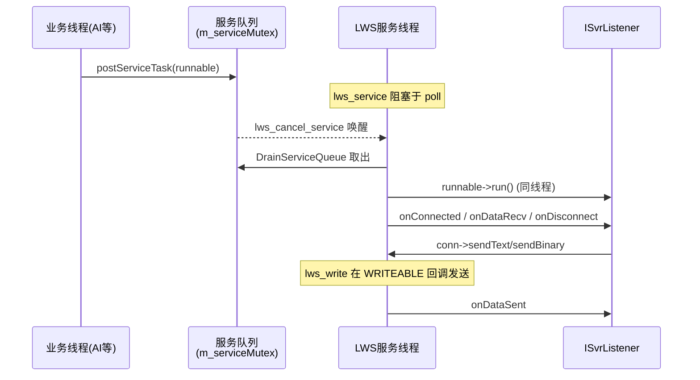
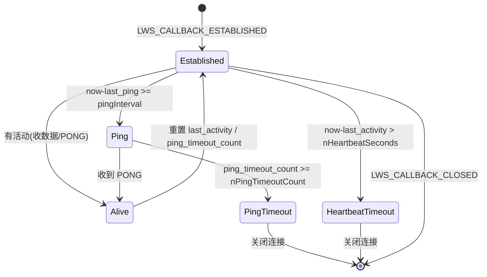
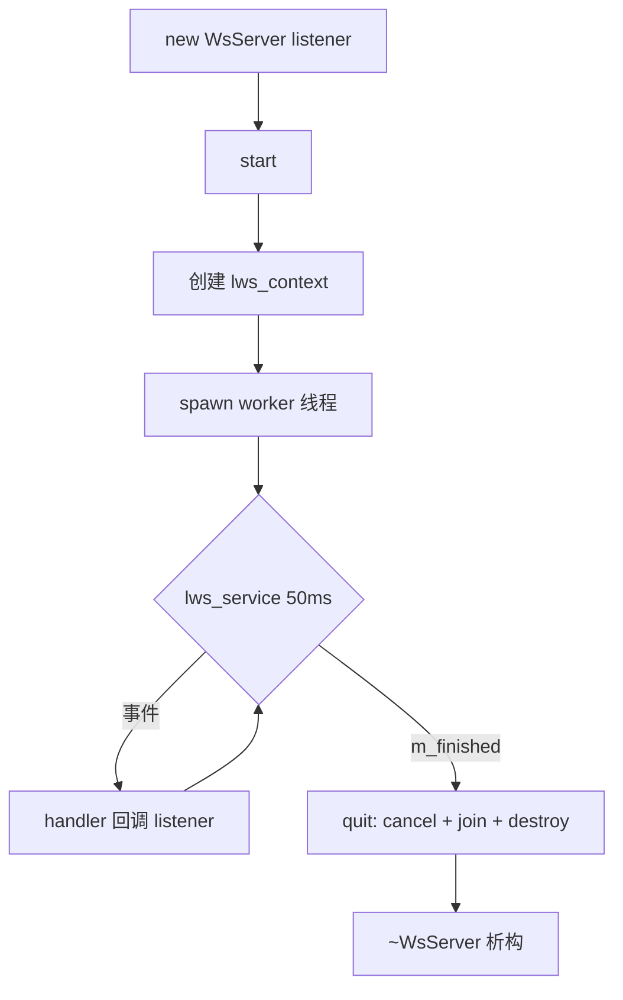
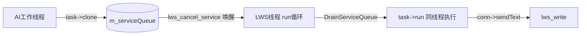

# SOUI `ws` 组件：设计与使用文档

> 组件路径：`components/ws/`
> 底层依赖：libwebsockets（[`third-part`](../../third-part) 或系统库）
> 接口定义：`SOUI/include/interface/ws-i.h`
> 配套心跳说明：`components/ws/README_HEARTBEAT.md`

本组件是 SOUI4 的 WebSocket 通信模块，封装了 **服务端（`WsServer`）**、**客户端（`WsClient`）** 与 **定时器发生器（`CTimerGenerator`）** 三层能力，对外通过 `IWebsocket` 工厂以 COM 风格接口暴露，供游戏（如 cnchess 中国象棋）等业务模块使用。

---

## 1. 模块概览

| 角色 | 文件 | 对外接口 | 线程模型 |
|------|------|----------|----------|
| 工厂 | `src/ws.cpp` | `IWebsocket`（`SCreateInstance` / `Ws_CreateInstance`） | 无状态，调用方线程 |
| 服务端 | `src/wsServer.{h,cpp}` | `IWsServer` / `ISvrListener` / `ISvrConnection` | 1 个 LWS 服务线程 + 调用方线程 |
| 客户端 | `src/wsClient.{h,cpp}` | `IWsClient` / `IConnListener` / `IConnection` | 1 个 LWS 服务线程 + 调用方线程 |
| 连接对象 | `src/Connection.{h,cpp}` | `ISvrConnection`（继承 `IConnection`） | 受 `m_mutex` 保护，跨线程安全 |
| 定时器 | `src/TimerGenerator.{h,cpp}` | `ITimerGenerator` / `ITimerListener` | 1 个专用定时器线程 |

**关键设计点**
- 所有网络事件都在 **LWS 服务线程** 上回调（`lws_service` 单线程串行派发），天然规避了同一条连接上的并发回调。
- 业务线程（如 AI 工作线程）通过 `IWsServer::postServiceTask()` 把任务**克隆**后投递回 LWS 线程串行执行，从而把"玩家结果落子"等动作与网络事件在同一线程上排序，避免加锁混乱（详见 §6）。
- 服务端与客户端各自拥有独立的一条 worker 线程；析构函数会 `quit()` 并 `join`，保证销毁时不再有回调飞出。

---

## 2. 架构图

### 2.1 服务端线程与数据流



### 2.2 心跳状态机（服务端视角）



---

## 3. 接口清单

### 3.1 工厂 `IWebsocket`
| 方法 | 说明 |
|------|------|
| `CreateWsClient(IConnListener*)` | 创建客户端实例 |
| `CreateWsServer(ISvrListener*)` | 创建服务端实例 |
| `CreateTimerGenerator()` | 创建独立定时器发生器（与具体 server 解耦） |
| `SetLogCallback(WsLogCallback)` | 重定向 libwebsockets 日志 |

### 3.2 服务端 `IWsServer`
| 方法 | 说明 |
|------|------|
| `start(port, protocolName, SvrOption, SvrPingCfg)` | 启动监听，返回 0 成功，非 0 失败码 |
| `wait(timeoutMs)` | 阻塞直到 `quit()`；`<0` 永久等待 |
| `quit()` | 停止服务并 join 工作线程 |
| `postServiceTask(const IRunnable*)` | 把任务投递到 LWS 线程（**克隆**，调用方栈对象可安全销毁） |

### 3.3 服务端连接 `ISvrConnection`（继承 `IConnection`）
除 `isValid / sendText / sendBinary` 外，扩展：
- `sendBinary2(DWORD dwType, data, len)`：在二进制帧前加 `(dwType,len)` 头，便于业务分发。
- `close(reason)`、`setId / getId / setGroupId / getGroupId`：连接标识与分组。

### 3.4 监听器回调
- 服务端 `ISvrListener`：`onConnected`（返回 `TRUE` 接受 / `FALSE` 拒绝）、`onConnError`、`onDisconnect`、`onDataSent`、`onDataRecv`。
- 客户端 `IConnListener`：`onConnected`、`onConnError`、`onDisconnect`、`onDataSent`、`onDataRecv`。
- 所有回调均在 LWS 线程上派发。

### 3.5 定时器 `ITimerGenerator` / `ITimerListener`
- `start(ITimerListener*)`：安装监听器并启动线程；可在 `setTimer` 之前或之后调用。
- `setTimer(id, ms, bRepeat=TRUE)`：`id=0` 自动分配；`bRepeat=FALSE` 为一次性（触发一次后自动摘除）。
- `killTimer(id)` / `stop()`：停止并 join 定时器线程，丢弃未派发的到期事件。
- `onTimer(id)`：**在定时器专用线程上**调用，业务层自行决定是否切回业务线程（如 `postServiceTask`）。

---

## 4. 服务端生命周期



要点：
- `start()` 会对心跳配置做防御性夹紧：`nHeartbeatSeconds<5→5`、`nPingTimeoutCount<2→2`、`pingIntervalSeconds>nHeartbeatSeconds/2 → 取一半`。
- 每个连接建立时（`LWS_CALLBACK_ESTABLISHED`）以 refcount=1 创建 `SvrConnection`，存入 wsi 的 per-session `userData`；关闭时（`LWS_CALLBACK_CLOSED`）由模块 `Release()` 该创建引用。
- **引用计数契约（重要）**：监听器若要在 `onConnected` 中持有连接，必须 `AddRef`；并在 `onDisconnect` 中对称 `Release`。模块在 `CLOSED` 里释放"创建引用"，二者合起来正好平衡（见 §7 设计注意）。

---

## 5. 客户端生命周期

`connectTo()` → worker 线程 `lws_service(100)` → 回调 `IConnListener` → `disconnect()`/`quit()` join 线程。

注意：
- `connectTo()` 在已连接/连接中返回 `-2`，重复调用会被拒绝。
- `isValid()` = `m_connected && !m_finished`，断线后自动为 false。
- `blockReceive(bBlock)` 提供"暂停派发接收回调、缓存到队列、解除时再回放"的能力（主要用于某些需要按业务节拍消费消息的场景）。

---

## 6. 跨线程任务投递 `postServiceTask`

这是把"非 LWS 线程产生的结果"安全送回网络线程的核心机制。



实现要点（`wsServer.cpp`）：
1. 入队前 **克隆** `task->clone()`，因此调用方栈上的 `IRunnable` 在返回后即可销毁（与 `ITaskLoop::postTask` 同语义）。
2. **仅当队列"从空变非空"才 `lws_cancel_service`**，唤醒正阻塞于 `lws_service/poll` 的服务线程——否则任务会拖延到下一次网络事件才被 `DrainServiceQueue` 处理（曾实测延迟 20s+）。
3. 任务在 LWS 线程上执行，因此回调与游戏消息天然串行，业务层通常无需再加锁。
4. `quit()` 后清空残留队列（服务线程已退出，不会再被排空）。

---

## 7. 定时器发生器 `CTimerGenerator`

纯生产者模型（对照 `swinx` 的窗口定时器实现，但更纯粹）：
- 单一专用线程持有全部定时器的"到期时刻表"（`std::map<id, TimerEntry>`，`steady_clock` 单调时钟）。
- 线程 `wait_until` 最早到期项；到期后在**定时器线程**直接调 `ITimerListener::onTimer`，不负责任何业务线程切换。
- 周期性定时器错过多个周期时**不补课**（避免对"周期性广播"类用途在短时间内爆发触发），仅 `SLOGW` 记录 overdue 并重置到 `now+period`。
- `start()` 之前登记的定时器，首拍在 `start()` 时统一重基到 `now+period`。
- `stop()` 在定时器线程自身内被调用时**不会自连接**（`join` 前判断线程 id），并先清空监听器指针、丢弃未派发事件。

---

## 8. 心跳机制

详见 `README_HEARTBEAT.md`。要点回顾：
- 定时器间隔 = `min(pingIntervalSeconds, nHeartbeatSeconds)`（最小 1s）。
- 两类独立超时：① 心跳超时（`now - last_activity > nHeartbeatSeconds`，含收数据/PONG）；② ping 超时（连续 `nPingTimeoutCount` 次 ping 无 PONG）。
- 推荐 `nHeartbeatSeconds > pingIntervalSeconds × nPingTimeoutCount`，否则心跳超时会先触发。
- PING 帧在 `LWS_CALLBACK_SERVER_WRITEABLE` 回调中发送（libwebsockets 规定写操作只能在该回调内进行）。

---

## 9. 使用示例

### 9.1 服务端（回显 + 分组广播）

```cpp
#include <interface/ws-i.h>
#include <helper/obj-ref-impl.hpp>
#include <com-loader.hpp>

using namespace SOUI;

class SvrListener : public TObjRefImpl<ISvrListener> {
    STDMETHODIMP_(BOOL) onConnected(ISvrConnection *p, const char *path, const char *args) override {
        p->AddRef();                 // 若要在别处持有连接，必须 AddRef
        p->setId(1); p->setGroupId(0);
        return TRUE;                 // FALSE 拒绝连接
    }
    STDMETHODIMP_(void) onDisconnect(ISvrConnection *p) override {
        p->Release();                // 与 onConnected 的 AddRef 对称
    }
    STDMETHODIMP_(void) onDataRecv(ISvrConnection *p, const void *d, int len, BOOL bin) override {
        p->sendText((const char*)d, len);   // 同线程，安全
    }
    // onConnError / onDataSent 略
};

int main() {
    SComLoader loader;
    IWebsocket *ws = nullptr; loader.CreateInstance(_T("ws"), (IObjRef**)&ws);
    SvrListener l;
    IWsServer *svr = ws->CreateWsServer(&l);
    SvrOption opt{FALSE, nullptr, nullptr};
    SvrPingCfg cfg{30, 120, 3};
    svr->start(3310, "upgrade", opt, cfg);
    svr->wait(-1);          // 阻塞直到 quit()
    svr->Release(); ws->Release();
}
```

### 9.2 客户端

```cpp
class ConnListener : public TObjRefImpl<IConnListener> {
    STDMETHODIMP_(void) onConnected() override { /* 连接成功 */ }
    STDMETHODIMP_(void) onDataRecv(const void *d, int len, BOOL bin) override { /* 处理 */ }
    // 其余回调略
};

IWebsocket *ws = ...; ConnListener l;
IWsClient *c = ws->CreateWsClient(&l);
ClientOption opt{FALSE, nullptr, FALSE, FALSE, FALSE};
c->connectTo("127.0.0.1", "/test/", 3310, "", opt);
for (int i=0;i<10;i++){ c->wait(1000); c->sendText("hello"); }
c->wait(-1);
c->Release(); ws->Release();
```

### 9.3 定时器（周期性广播在线人数）

```cpp
class Game : public TObjRefImpl<ISvrListener>, public ITimerListener {
    SAutoRefPtr<ITimerGenerator> m_timer;
    IWsServer *m_svr;
public:
    void GameStart() {
        m_timer.Attach(m_svr->Get...); // 实际通过 IWebsocket::CreateTimerGenerator()
        m_timer->start(this);                       // this 同时实现 ITimerListener
        m_timer->setTimer(TIMER_ONLINE, 1000, TRUE); // 每 1s
    }
    void STDMETHODCALLTYPE onTimer(UINT_PTR id) override {
        if (id == TIMER_ONLINE)
            m_svr->postServiceTask(makeRunnable([this]{ broadcastOnlineCount(); }));
    }
    ~Game() { if (m_timer) m_timer->stop(); } // 先停定时器再 Release server
};
```

> ⚠️ 退出顺序：先 `ITimerGenerator::stop()`，再释放 `IWsServer`，否则 `onTimer` 可能向半销毁的 server 投递。`stop()` 之后 `setTimer` 一律被拒。

---

## 10. Review 发现的问题清单

> 以下为对当前 `components/ws` 源码的静态审查结论（未实跑完整构建，已对照 libwebsockets 回调语义逐项核对）。

| # | 位置 | 严重度 | 问题 | 状态 / 修复 |
|---|------|--------|------|----------|
| 1 | `wsClient.cpp` `quit()`；`wsServer.cpp` `quit()` | 🔴 严重 | **自连接崩溃**：`quit()`/`disconnect()` 若在 LWS 工作线程内的监听器回调中被调用，`m_finished` 为 false 走慢路径，执行 `m_worker.join()` 当前线程 → `std::terminate` 直接终止进程。快路径只覆盖了 `m_finished` 已为 true 的情形。 | ✅ **已修复**：① 慢路径 join 前判断 `this_thread == m_worker`，命中则 `detach()`；② 把 `lws_context_destroy` 收尾**移入 `run()`**，使 detach 路径不再泄漏 context、也不会跨线程销毁；③ 新增 `m_teardownDone` 条件变量，由**析构函数（另一线程）**等待 `run()` 真正收尾，避免 UAF。注意：`joinOrDetachWorker` 内部**不能**等待该条件变量，否则会与 `run()` 置位它的同一线程相互死锁。 |
| 2 | `wsServer.cpp` `postServiceTask` | 🟠 中 | **空指针解引用**：`pClone.Attach(task->clone())` 未校验 `clone()` 返回值。若业务层 `IRunnable::clone()` 返回 `nullptr`，入队后 `DrainServiceQueue` 中 `tasks[i]->run()` 崩溃。 | ✅ **已修复**：`clone()` 返回空时改为 `const_cast` 后 `AddRef` 持有**原对象**，既避免空指针崩溃，又满足"返回即可销毁"的契约；并新增 `task==nullptr` 早退。 |
| 3 | `wsServer.cpp:287-311` `LWS_CALLBACK_SERVER_WRITEABLE` | 🟡 低 | **PING 可能被推迟**：仅当 `bPingPending && sendingBuf.empty()` 才发 PING。若 PING 请求时发送缓冲非空、且之后没有新数据触发 `WRITEABLE`，PING 会等到下一个定时器周期才补发。可自愈，但极端情况下延长死连接检测。 | ⏳ 待处理（可自愈，列为低优先） |
| 4 | `wsServer.h` `WsCfg` | ⚪ 设计 | **死代码**：`WsCfg` 继承 `SvrPingCfg` 并给出默认值，但 `start()` 用的是调用方传入的 `pingCfg`，`WsCfg` 从未被使用。 | ✅ **已修复**：已删除 `WsCfg` 类。 |
| 5 | `README_HEARTBEAT.md:162-163` | ⚪ 文档 | 引用了不存在的 `HEARTBEAT_FIX.md` / `BUGFIX_SUMMARY.md`。 | ✅ **已修复**：失效引用已改为指向本设计文档 `README.md`。 |
| 6 | `wsServer.h` / `wsClient.h` | ⚪ 设计 | **监听器裸指针**：server/client 以裸指针保存 `ISvrListener`/`IConnListener`，未 `AddRef`。若监听器在 server/client 销毁前被释放，回调会悬空。析构虽 `join` 了工作线程，但属"靠约定保证"。 | ⏳ 待处理（涉及 ABI/业务层生命周期，需单独评估） |
| 7 | `Connection.cpp` + `wsServer.cpp:219-272` | ⚪ 设计 | **引用计数契约脆弱**：`SvrConnection` 在 `ESTABLISHED` 以 refcount=1 存入 `userData`，模块在 `CLOSED` 释放该"创建引用"。监听器必须严格 `onConnected` 内 `AddRef`、`onDisconnect` 内 `Release`，否则泄漏或重复释放。 | ⏳ 待处理（同上，需单独评估） |
| 8 | `Connection.cpp` / `wsClient.cpp` `send()` | 🟡 低（性能） | 每次 `send()` 都 `lws_cancel_service(m_context)` 唤醒整个服务线程，高吞吐场景有不必要的唤醒开销。 | ⏳ 性能提示（当前实现**正确**） |
| 9 | `wsServer.cpp:36-42` 心跳夹紧 | 🟡 低 | `pingIntervalSeconds` 未做下限/禁用语义夹紧：调用方传 0 会被当作"每秒 ping"，而非"不 ping"。 | ✅ **已修复**：`start()` 在现有上限夹紧后新增 `pingIntervalSeconds < 1 → 1` 的下限夹紧。 |

### 正向评价（已做对的地方）
- `postServiceTask` 的"仅空变非空才 `lws_cancel_service`"修复到位，注释清晰，解决了任务延迟问题。
- `CTimerGenerator` 纯生产者模型清晰，单调时钟 + 不补课 + `stop()` 不自连接，线程安全处理严谨。
- `SvrConnection` 发送路径处理了**部分写**（`LWS_WRITE_CONTINUATION` 续传）与**管道阻塞**（`lws_send_pipe_choked` 重排 writable），较完整。
- `CLOSED` 回调在回收 wsi 前先把 `m_socket` 置空，使并发 `send()` 快速失败而非触碰悬空 `lws*`，避免了典型的 UAF。
- 心跳配置的多重防御性夹紧，降低了误用导致连接抖动的概率。

---

## 11. 安全与健壮性提示

- **证书**：`cert/server.crt`、`cert/server.key` 为示例自签名证书，已随仓库提交，**生产环境必须替换**并妥善保管私钥，切勿对外发布真实私钥。
- **SSL 选项**：服务端 `bSecure` 时强制 `LWS_SERVER_OPTION_DO_SSL_GLOBAL_INIT`；客户端提供 `allowSelfSigned` / `skipServerCertHostnameCheck` / `allowExpired`，这些开关仅用于测试/内网，**生产客户端不应全部开启**，否则会削弱对中间人攻击的防护。
- **URI 解析**：`onConnected` 中用 `lws_hdr_copy` 拷贝 path/args，缓冲区固定（`kMaxPath=100`、`kMaxArgs=1024`），超长会被截断而非溢出，安全；但业务层解析 `uriArgs` 时应做好格式校验（示例 `sscanf` 无长度保护）。
- **跨线程**：业务线程绝不能直接调用 `conn->sendText` 以外的 LWS API；一切写回网络的操作都应经 `postServiceTask` 或已在 LWS 线程内的回调进行。

---

## 12. 构建说明

- `CMakeLists.txt` 用 `file(GLOB src/*.cpp)` 收集源文件；**新增 `.cpp` 后需重跑 `cmake -S . -B build`** 才会纳入编译（"Checking File Globs" 不一定真正触发重配）。
- 链接：`websockets` + `utilities4`；非 Windows 额外链接 `swinx`。
- `SOUI_ENABLE_COM_LIB` 关闭时编为 `SHARED`（COM 组件），开启时编为 `STATIC`。
- 测试程序 `test/ServerTest.cpp`、`test/ClientTest.cpp`、`test/HeartbeatTest.cpp` 当前被 `if(0)` 包裹未编入，需手动启用或单独编译验证心跳与收发。

---

## 13. 待办 / 后续建议

> 截至本版，🔴 #1（自连接崩溃）、🟠 #2（空克隆）、⚪ #4（死代码）、⚪ #5（文档引用）、🟡 #9（心跳下限夹紧）均已修复并通过静态核对。
> 以下为尚未处理的项（多为设计/性能层面，需单独评估 ABI 与业务层生命周期，不在本次修复范围）：

1. **#3**：PING 在发送缓冲非空时可能被推迟到下一周期；可自愈，低优先。
2. **#6 / #7**：监听器与 `SvrConnection` 的引用计数归属建议改为由 server 以 `SAutoRefPtr` 持有全周期，解除对业务层"对称 `AddRef`/`Release`"的隐式依赖；涉及接口契约，需单独评估。
3. **#8**：高吞吐下每次 `send()` 唤醒整个服务线程的性能提示（当前实现正确）。
