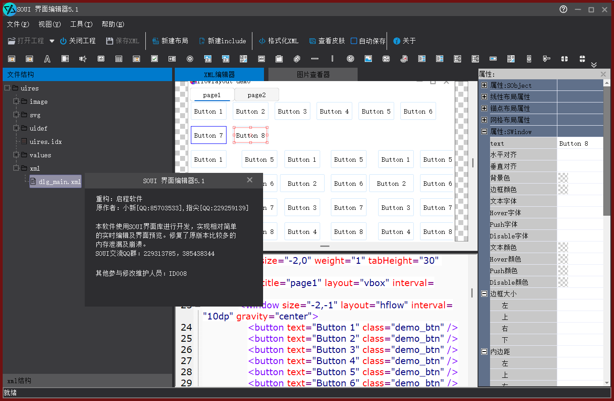

# UIEditor 技术架构详解

## 1. 基于STreeVie
w的资源管理框架

UIEditor采用STreeView控件实现了一套强大的资源管理框架，主要通过`CFileTreeAdapter`类来管理文件系统的显示和操作。

### 1.1 核心组件

- **CFileTreeAdapter**：继承自`STreeAdapterBase<FileItemData>`，负责将文件系统结构转换为树状视图
- **FileItemData**：存储文件/目录的基本信息，包括路径、名称、类型等
- **PathMonitor**：监控文件系统变化，实现实时更新

### 1.2 跨平台模式实现

UIEditor基于SWinx框架实现了跨平台支持，主要体现在：

#### 1.2.1 拖放功能（OLE Drag Drop）

- **FileTreeDragdrop.h**：实现了文件树的拖放功能
- **DropTarget.h**：实现了拖放目标的处理
- **CMainDlg::SerializeItemsToClipboard**：将选中的文件项序列化到剪贴板
- **CMainDlg::DeserializeItemsFromClipboard**：从剪贴板反序列化文件项

#### 1.2.2 文件系统监控（FindFirstChangeNotification）

- **PathMonitor.cpp**：使用Windows API `FindFirstChangeNotification`监控目录变化
- **CPathMonitor::Run**：在后台线程中监控文件系统变化
- **CMainDlg::OnFileChanged**：处理文件变化事件，更新UI

```cpp
// PathMonitor.cpp:113
HANDLE h = FindFirstChangeNotification(m_strPath.c_str(), TRUE, FILE_NOTIFY_CHANGE_LAST_WRITE | FILE_NOTIFY_CHANGE_FILE_NAME | FILE_NOTIFY_CHANGE_DIR_NAME);
```

### 1.3 资源管理功能

- **文件操作**：支持创建、复制、移动、删除文件和目录
- **剪切状态管理**：通过`SetItemCutState`和`ClearAllCutStates`管理剪切状态
- **路径查找**：通过`FindItemByPath`根据路径查找树项
- **实时更新**：通过PathMonitor实现文件系统变化的实时响应

## 2. 基于Config的工具栏创建

UIEditor使用外部配置文件创建工具栏，实现了高度的可定制性。

### 2.1 配置文件结构

- **Config/Ctrl.xml**：定义控件工具栏配置
- **Config/Skin.xml**：定义皮肤工具栏配置
- **Config/LayoutTmpl/**：存储布局模板

### 2.2 工具栏初始化流程

1. **CMainDlg::InitWidgetToolbar**：初始化控件工具栏
2. **CMainDlg::InitSkinToolbar**：初始化皮肤工具栏
3. **CSysDataMgr**：管理配置文件的加载和解析

```cpp
// MainDlg.cpp:1630-1661
void CMainDlg::InitWidgetToolbar(){
    SXmlNode xmlNode = CSysDataMgr::getSingleton().getCtrlDefNode();
    SXmlNode xmlIconSkin = xmlNode.child(L"toolbar").child(L"icons");
    ISkinObj *pSkin = SApplication::getSingleton().CreateSkinByName(xmlIconSkin.attribute(L"class_name").as_string(SSkinImgList::GetClassName()));
    if (pSkin)
    {
        pSkin->InitFromXml(&xmlIconSkin);
        m_skinPool->AddSkin(pSkin);
        pSkin->Release();
    }
    // ...
    SToolBar *pToolBar = FindChildByID2<SToolBar>(R.id.tb_widget);
    pToolBar->SetIconsSkin(pSkin);
    for(int i = 0; i < arrIcons.GetCount(); i++){
        pToolBar->AddButton(i,arrIcons[i].iIcon,arrIcons[i].strTxt);
    }
    m_tbWidget = pToolBar;
}
```

### 2.3 动态工具栏管理

- **UpdateEditorToolbar**：根据当前编辑的文件类型切换工具栏显示
- **OnTbWidgetClick**：处理控件工具栏点击事件
- **OnTbSkinClick**：处理皮肤工具栏点击事件

## 3. 资源隔离机制

UIEditor实现了预览窗口资源和编辑器自身资源的隔离，确保预览效果与实际应用一致。

### 3.1 核心实现

- **ResManger**：管理UI资源文件
- **SSkinPool**：皮肤池，用于隔离不同资源包的皮肤
- **PreviewHost**：预览窗口的宿主，使用独立的资源上下文

### 3.2 资源隔离流程

1. **CMainDlg**在构造函数中创建独立的皮肤池：
   ```cpp
   m_skinPool.Attach(new SSkinPool());
   SUiDef::getSingleton().PushSkinPool(m_skinPool);
   ```

2. **打开资源包**时，通过`ResManger`加载资源：
   ```cpp
   if(!m_UIResFileMgr.OpenProject(m_strUiresPath))
   {
       SLOGW()<<"open project file failed";
       return FALSE;
   }
   ```

3. **预览窗口**使用独立的资源上下文，确保预览效果与实际应用一致

## 4. FrameLayout布局框架

UIEditor使用FrameLayout实现了类似MFC CFrameWnd的布局框架，包含菜单、工具栏、状态栏和主视图。

### 4.1 布局结构

- **菜单**：顶部菜单栏，通过XML定义
- **工具栏**：主工具栏、控件工具栏、皮肤工具栏
- **状态栏**：底部状态栏，显示状态信息
- **主视图**：中央编辑区域，包含文件树、XML编辑器和图像查看器

### 4.2 布局实现

- **dlg_main.xml**：主窗口布局定义
- **dlg_main_left.xml**：左侧文件树布局定义
- **STabCtrl**：用于切换XML编辑器和图像查看器
- **SDockWnd**：用于停靠属性面板等可调整窗口

### 4.3 窗口管理

- **OnSize**：处理窗口大小变化
- **OnMaximize/OnRestore/OnMinimize**：处理窗口状态变化
- **EventUpdateCmdUI**：更新命令UI状态

## 5. 技术亮点

1. **模块化设计**：清晰的职责划分，各模块之间耦合度低
2. **跨平台支持**：基于SWinx框架，实现了跨平台的拖放和文件监控
3. **实时响应**：使用PathMonitor实时监控文件系统变化
4. **资源隔离**：通过独立的皮肤池实现资源隔离
5. **可定制性**：通过外部配置文件实现工具栏的可定制
6. **用户友好**：提供直观的文件树操作和拖放功能

## 6. 代码优化建议

1. **性能优化**：
   - 文件树枚举时可考虑使用异步加载，避免大目录导致UI卡顿
   - PathMonitor可增加监控深度限制，减少系统资源消耗

2. **代码结构优化**：
   - 可将文件操作相关功能从CMainDlg中提取到单独的类
   - 增加更多的异常处理，提高程序稳定性

3. **功能增强**：
   - 增加文件搜索功能
   - 支持更多文件类型的预览
   - 增加代码自动完成的智能提示

## 7. 总结

UIEditor是一个功能强大的UI资源编辑工具，基于SOUI框架实现了一套完整的资源管理和编辑系统。它通过STreeView实现了直观的资源管理界面，通过PathMonitor实现了实时的文件系统监控，通过外部配置文件实现了高度可定制的工具栏，通过资源隔离机制确保了预览效果的准确性，通过FrameLayout实现了专业的界面布局。

这些技术的综合应用，使得UIEditor成为一个高效、直观、功能完备的UI资源编辑工具，为SOUI框架的使用者提供了极大的便利。