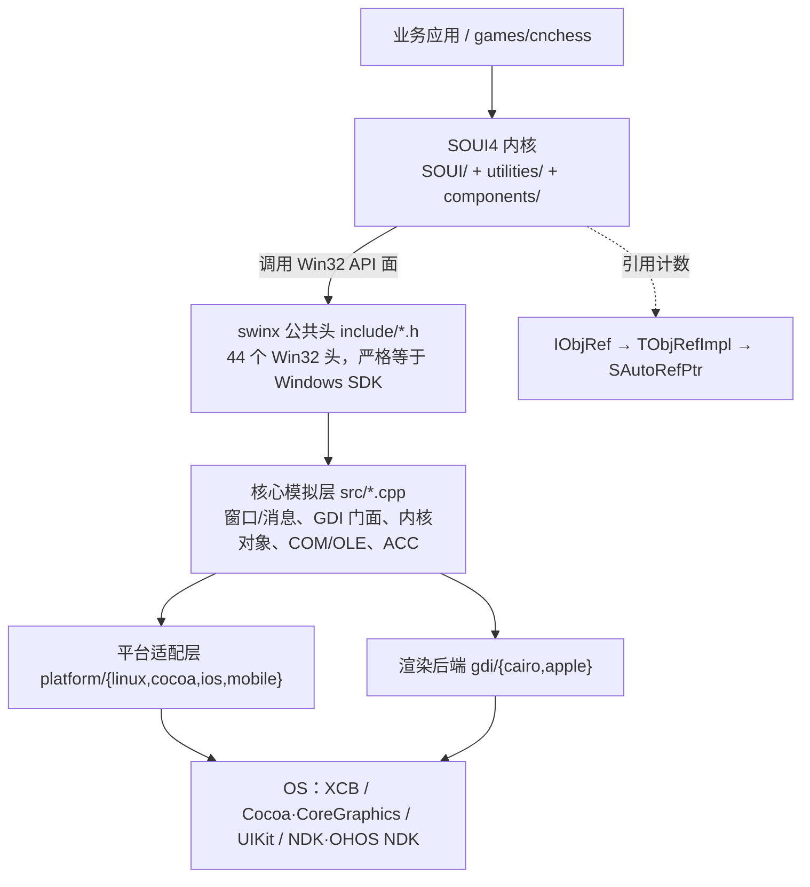
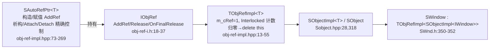
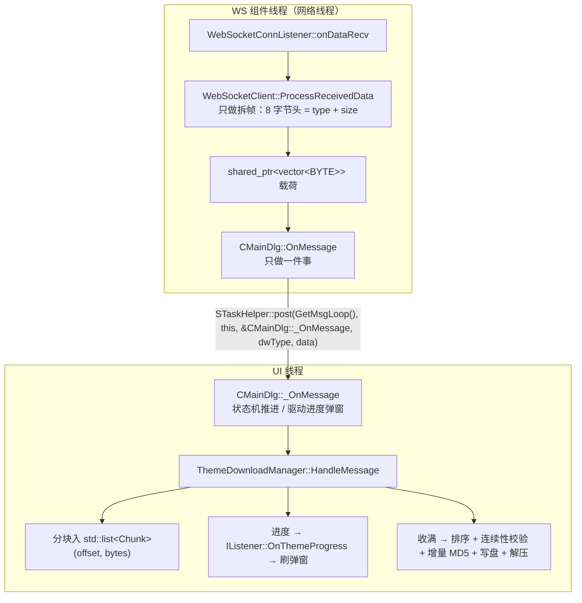

# SOUI4 跨平台 C++ GUI 框架项目评估报告

> **评估时间**：2026-09-19
> **代码基线**：`soui4` 主仓库 HEAD `b4cf3a88`（2026-09-19，`ChangeLog.md` 标注内核 **5.3**）；`swinx` 子模块 HEAD `5424f7d`（2026-09-19，`swinx/version.txt` 标注 **1.5**）
> **评估范围**：SOUI4 内核（`SOUI/`、`utilities/`）、跨平台层 `swinx/`、组件 `components/`、扩展控件 `controls.extend/`、移动端宿主库 `soui-android-lib/`·`soui-ohos-lib/`、跨平台示例 `games/cnchess/`，以及 `.github/workflows/`、`README.md`、`ChangeLog.md` 中的公开声明
> **方法**：所有机制性结论均回当前源码逐条核对；规模/计数取自仓库当前状态下的实测（`git ls-files`、`wc -l`、`api_scan` 扫描、CMake 配置期生成的 CTest 清单），不引用任何历史版本数字
> **本文性质**：面向技术决策的**当前状态**评估——只描述"现在是什么样"，不记录历史排障过程与演进叙事；既列优势也列风险，不做营销式结论

---

## 〇、一句话结论

SOUI4 是一套**以 Win32 API 语义为统一编程面**的 C++ DirectUI 框架，借助自研的 `swinx` 兼容层，让**同一套 C++ UI 与业务代码**在 Windows / Linux / macOS / iOS / Android / OpenHarmony 六端原生运行；其类 COM 引用计数（`AddRef/Release` + `SAutoRefPtr`）系统性地降低了 C++ 内存泄漏风险；以 `games/cnchess` 为例，核心绘制/逻辑代码零平台宏、`__ANDROID__` 在**业务源码**中出现次数为 **0**，证明"一次编写、六端运行"是**工程现实而非口号**。

**但"所有跨平台框架中最小体积"是相对结论**（相对 Qt / Electron / Flutter 这类带运行时或虚拟机的方案成立）。当前需要正视的短板是：**面向移动端的自动构建与回归仍是空白**（CI 只覆盖 Windows / Linux / macOS 桌面三端）、**单作者（bus factor = 1）**、`swinx` **尚未覆盖"迁移既有 Windows 程序"所需的接口面**（原生控件库 / 窗口菜单栏 / 资源对话框，见 §3.5）、**OHOS 无障碍（ACC）在构建层被强制关闭**、**OHOS 深度适配待真机验证**，以及第三方 vendor 代码占两仓库受控文件约 **67.6%**（完整工作区约 78.6%）。
## 一、项目概况

| 维度 | 事实 | 出处 |
|---|---|---|
| 定位 | 轻量跨平台 C++ DirectUI 框架，持续开发 **14 年** | `README.md:37` |
| 版本 | 内核 **5.3**（含 Android/iOS/OHOS 适配）；`swinx` **1.5** | `ChangeLog.md`、`swinx/version.txt` |
| 核心编译体积 | **约 2 MB**（官方声明，动态链接核心库） | `README.md:37` |
| 跨平台面 | 6 平台：Windows / Linux / macOS / iOS / Android / OHOS | `README.md:39-52` |
| 渲染后端 | GDI / Direct2D（Win）、Skia（跨平台主流）、Cairo（swinx 内）、Core Graphics（Apple） | `README.md:47-52,60`、`components/render-*` |
| 内存模型 | 类 COM 引用计数 + 智能指针 `SAutoRefPtr` | `utilities/include/helper/obj-ref-impl.hpp` |
| 编程风格 | Win32/WTL 式 API + XML 描述 UI（UI 与逻辑分离） | `README.md:37,64-70` |
| 生态 | `demos/` **18 个子目录**（含可视化设计器 `uieditor`、单元测试工程 `fun_test`）、`games/` **4 个示例**（中国象棋 `cnchess`、军棋 `junqi`、升级/四国军棋 `upgrade`、音频 `audio`）、Lua/JS/Python 绑定 | `demos/`、`games/`、`README.md` |
| CI | **已有 3 个 GitHub Actions 工作流**：全平台构建矩阵、PR 三平台核心验证、Linux Xvfb GUI 烟测（详见 1.3） | `.github/workflows/{build,pr-core,gui-smoke}.yml` |
| 许可 | 自有商业条款（非商用免费，商用收费）；`swinx` 内含 Wine 派生代码并单列披露 | `LICENSE-en.md`、`LICENSE-zh.md`、`swinx/license_CN.txt` |

### 1.1 代码规模（当前实测）

框架**自有源码**（不含 `third-part/` 与 `swinx/thirdparty/` 的 vendor 代码）：

| 模块 | 源文件 | 行数（`wc -l` 口径） |
|---|---:|---:|
| `SOUI/`（DirectUI 内核） | 408 | 144,565 |
| `utilities/`（基础件） | 53 | 35,119 |
| `components/`（可插拔组件） | 172 | 82,814 |
| `controls.extend/`（扩展控件） | 219 | 55,450 |
| `swinx/`（`src/` + `include/`） | 218 | 162,819 |
| `soui-android-lib/` + `soui-ohos-lib/` | 18 | 6,740 |
| **合计** | **1,088** | **487,507** |

> 其中 **`SOUI/` + `utilities/` = 179,684 行**是框架的真正内核；`swinx` 的 162,819 行是"让内核在非 Windows 上零改动编译"的代价与资产。

### 1.2 仓库文件构成（`git ls-files` 口径）

| 分区 | 受控文件数 |
|---|---:|
| 主仓库 `soui4` 合计 | **9,286** |
| ├ `third-part/`（vendor，含 3 个嵌套子模块） | 3,921 |
| ├ `demos/`（示例 + 设计器 + 测试工程） | 2,863 |
| ├ `games/`（棋牌示例） | 912 |
| ├ `SOUI/` | 412 |
| ├ `wizard/`（VS 向导） | 275 |
| ├ `components/` · `controls.extend/` | 229 · 222 |
| └ `utilities/` · `tools/` · `doc/` · 移动端 lib · `__cmake/` | 58 · 64 · 39 · 48 · 10 |
| `swinx` 子模块合计 | **8,112** |
| ├ `swinx/thirdparty/`（vendor） | 7,843 |
| └ `swinx` 自有（`src/` `include/` `doc/` 等） | 269 |

**第三方 vendor 合计 11,764 个受控文件（`third-part/` 3,921 + `swinx/thirdparty/` 7,843）**，在"主仓库 + swinx"两个仓库的受控文件合计（17,398）中占 **67.6%**——其中 `third-part/` 占主仓库 42.2%、`swinx/thirdparty/` 占 swinx 子模块 **96.7%**。若把嵌套子模块（`third-part/` 下的 `libwebsockets` / `libcurl` / `openssl-cmake`）的实际检出文件一并计入完整工作区（约 26,362 个文件，已排除构建产物），第三方占比约 **78.6%**。

> 代价换来的是**零版本兼容风险**：cairo / fontconfig / freetype / xkbcommon / dbus / skia / richedit41 等全部按源码 vendor 化，构建不依赖发行版提供什么版本。代价是 clone 体积、全文检索与代码统计体验明显受影响。

### 1.3 CI 与自动化现状（需与"门禁已生效"区分）

前两节统计的是静态规模；本节记录这些源码当前被怎样自动构建与验证。

| 工作流 | 触发 | 覆盖 | 做什么 |
|---|---|---|---|
| `build.yml` | push tag、push `build-test` 分支 | Windows/Linux/macOS × x64/x86/arm64（Linux 无 x86、macOS 无 x86） | 全量构建 + `ctest -L '^soui-headless$'` + 上传 demo 制品 |
| `pr-core.yml` | PR → `master` | linux-x64 / windows-x64 / macos-arm64 | 只构建 `fun_test` 目标 + 跑 `soui-headless` 门禁（失败时用 gdb 打印可疑用例栈） |
| `gui-smoke.yml` | PR → `master`、手动 | linux-x64（Xvfb） | `-DSOUI_ENABLE_GUI_SMOKE=ON` 后跑 `soui-gui` 真实宿主窗口烟测 |

> ⚠️ **边界**：工作流文件的存在只证明"门禁已定义"，**不等价于"线上 Required Check 已生效"**——后者须在 GitHub 仓库的分支保护规则中现场核验。另需注意 `build.yml` 不跑 PR，PR 侧的覆盖完全由 `pr-core.yml`（三平台、只构建 `fun_test`）与 `gui-smoke.yml` 承担。

---

## 二、架构总览

### 2.1 分层结构



### 2.2 模块划分

- **`SOUI/`**：DirectUI 内核——窗口树（`SWindow`）、消息路由（`SwndMsgCracker.h`）、事件系统、布局、动画、XML 对象工厂（`SObjectFactory`）；其 `control/` 子目录收纳**基础控件**（当前 38 个控件头文件，含 1 个聚合头 `SouiCtrls.h`），MVC 虚拟列表 `SListView`/`SMCListView`/`STreeView`/`STileView`/`SComboView` 即位于此处。
- **`utilities/`**：与 UI 无关的基础件——接口定义（`interface/`）、引用计数实现（`helper/obj-ref-impl.hpp`）、XML（`xml/SXml.h`，pugixml 封装）、字符串/数学、COM 动态加载（`com-loader.hpp`）。
- **`swinx/`**：跨平台兼容层（详见第三章）。Windows 下**不编译**；作为 git 子模块独立演进。
- **`components/`**：16 个可独立链接的组件——`render-skia`/`render-gdi`/`render-d2d`（渲染）、`imgdecoder-stb`/`imgdecoder-wic`/`imgdecoder-gdip`（解码）、`resprovider-zip`/`resprovider-7zip`（资源）、`ws`/`network`/`httpclient`/`TaskLoop`/`SIpcObject`（网络与任务）、`ScriptModule-LUA`、`log4z`、`translator`。**按需装载，未用组件不链入**——这是体积可控的关键。
- **`controls.extend/`**：扩展控件——基础控件之外的**可选额外控件**集合（属性网格 `SPropertyGrid`、日历 `SCalendar2`、图表 `hellocharts`、网格 `gridctrl`、Scintilla 编辑器、GIF 播放等）。MVC 虚拟列表**不在**此目录，而属于 `SOUI/` 基础控件。
- **`soui-android-lib/` / `soui-ohos-lib/`**：移动端宿主库——把 `SApplication` 托管进 `GameActivity`（JNI）/ `EntryAbility`（N-API），并填写 `PlatformAPI` 结构体。
- **`demos/` / `games/`**：示例与跨平台样板（`cnchess` 为六端验证样本）。

> 以上是模块边界。后续各章依次深入：第三章看跨平台层 swinx（评估重点），第四章看框架自身的工程能力，第五章看性能取向与线程协作，第六章用 cnchess 做实证，第七章与主流框架横向对照，第八章汇总优势与风险，第九、十章给出路线图与结论。

---

## 三、swinx 跨平台能力深度剖析（评估重点）

本章是评估重点。先看 swinx 的设计哲学与量化现状（3.1–3.4），再看它的**兼容边界**与**互操作代价**（3.5–3.6），最后用两个重组件移植案例收口（3.7–3.8）。

### 3.1 设计哲学：以 Win32 为"世界语"

swinx 不是"为每个平台写一套抽象接口"，而是**重演 Win32 语义**——`include/` 下 **44 个头文件**（`windows.h`/`gdi.h`/`unknwn.h`/`oleacc.h`/`textserv.h`…）与 Windows SDK **同名同结构**。因此 SOUI 内核直接 `#include <windows.h>`，**零平台 `#ifdef`**。

> 价值：下游（SOUI 内核、业务代码）完全不感知平台差异。这与 Qt（自有 Q* 体系）、Flutter（Dart + 自绘）、wxWidgets（每平台原生控件 + 不同 API）的路径都不同——SOUI 选择"让 Windows 程序员用原生手感写一次，六端编译"。

### 3.2 六平台 × 渲染后端矩阵

各 `*.cmake` 用 `file(GLOB)` 把当前平台源文件自动纳入编译，**新增 `.cpp/.mm` 不需改 cmake**。实际编译归属：

| 目标平台 | 平台适配层 | 渲染后端 | 构建脚本 | 平台专有依赖 |
|---|---|---|---|---|
| Windows | （不编译 swinx，用系统 Win32） | GDI / D2D | MSVC/MinGW | Win32 SDK |
| Linux（桌面） | `platform/linux` | `gdi/cairo` | `linux.cmake` | ALSA（可选）、xcb / xkbcommon / dbus |
| macOS | `platform/cocoa` | `gdi/apple` | `macos.cmake` | Cocoa / CoreGraphics / Carbon / CoreServices |
| iOS | `platform/ios` | `gdi/apple` | `ios.cmake` | UIKit |
| Android | `platform/mobile` | `gdi/cairo` | `mobile.cmake` | Android NDK（JNI） |
| OpenHarmony | `platform/mobile` | `gdi/cairo` | `mobile.cmake` | OHOS NDK（`napi` / `native_window`） |

> **设计要点**：`platform/*`（窗口壳/事件循环/剪贴板/IME/拖放/DPI）与 `gdi/*`（绘制）是**两个正交维度**——当前 `platform/` 有 4 个目录（`cocoa`/`ios`/`linux`/`mobile`，`mobile` 同时服务 Android 与 OHOS），`gdi/` 有 2 个（`cairo`/`apple`）。Linux 与 Android/OHOS 复用 Cairo 渲染而平台层不同；macOS 与 iOS 反之。**新增平台与新增渲染后端互不牵连**。

### 3.3 三大核心机制

1. **同符号、分目录实现、链接期解析**（`src/SwinxUtils.h`）
   跨平台公共助手声明集中于 `src/SwinxUtils.h`（如 `swinx_messageBeep`），各平台目录给出**同名同签名**实现。`GLOB` 只把当前平台源文件编入，于是调用方写同一个函数名、正文中**无平台 `#ifdef`**。返回类型统一用 `int` 而非 `BOOL`，是为规避 ObjC++ 中 `BOOL` 是 `bool`/`signed char` 的差异。

2. **`g_platformAPI` 回调机制**（`swinx/include/platform_api.h`，`PLATFORM_API_VERSION = 3`）
   Android/OHOS 无桌面窗口系统、由宿主 App 提供窗口/输入/剪贴板，故共用 `platform/mobile`。在**窗口系统 / 输入 / 剪贴板 / 提示音这类需要平台真实能力的层面**，**转发 `g_platformAPI`**（如 `MessageBeep → audio.messageBeep`，与 `PlaySound`/`ShowSoftKeyboard` 同路），由宿主应用（`soui-android-lib`/`soui-ohos-lib`）补差异。`PlatformAPI_Init`（`swinx/src/platform_api.cpp`）**严格比对版本**，不一致拒绝注册——这是跨版本演进的契约护栏。

3. **非 MSVC 工具链上的 COM 自研**（`src/SUnkImpl.h`）
   gcc/clang 无 `__uuidof`，swinx 用四件套补齐：`DECLARE_INTERFACE_` 宏集（`basetyps.h`）、`__uuidof/__suidof` 降级为 `X::GetIID()`（`guiddef.h`）、`IUNKNOWN_BEGIN/ADD_IID/END` 宏 + `SUnkImpl<T>`（`m_cRef` + `OnFinalRelease` → `delete this`）、`DEFINE_GUID` 以 `__attribute__((weak))` 弱符号防重定义。`BSTR/VARIANT/SAFEARRAY/IDispatch` 全部自研。**这让 SOUI 的 ACC 代码一字不改跨三桌面平台编译**。

### 3.4 量化现状

| 维度 | 当前数据 |
|---|---|
| 代码规模 | `src/` + `include/` = **162,819 行**（218 个文件），不含 vendored `thirdparty/` |
| 公共 Win32 头 | **44 个**，严格等于 Windows SDK 目录结构 |
| API 面 | 声明 **1,042**；有定义 **913**（完整实现 884 / 部分实现 6 / 空实现或语义桩 23）；仅保留声明 **129**（其中 6 项为扫描器误收录的宏，**实际未提供 123 项**） |
| API 分层分布 | KERNEL32 等价 335 · USER32 等价 242 · GDI32 等价 178 · COM/OLE 61 · COMCTL/SHELL 56 · 多媒体与杂项 41 |
| 真实功能缺口（声明层面） | **6 项**（5 项待排期 + 1 项已澄清，见 3.5） |
| **接口面缺口（迁移面）** | **原生控件库 / 窗口菜单栏 / 资源对话框未建立**：内置注册的窗口类仅 `Static`/`Button`/`ListBox` 三个；`SetMenu`/`GetMenu`/`DrawMenuBar` 无声明；`InitCommonControls(Ex)` 无定义、`DialogBoxParam` 族全缺（逐条见 3.5） |
| 测试 | `demos/fun_test`：**31 个 `test_*.cpp` + 328 处 `TEST` 声明**，其中 **325 条登记为 `soui-headless` CTest 门禁**（323 单元 + 1 集成 + 1 无窗口 E2E） |
| 无障碍（ACC） | **约 6,400 行**支撑桌面三平台，全部为自研：SOUI 侧 `SWndAccessible.h`(318)+`SwndAccessible.cpp`(606)+`msaa/SAccProxyCmnCtrl.cpp`(773)+`SAccProxyWindow.cpp`(201)；swinx 侧 MSAA 运行时 `oleacc.cpp`(768)、Linux AT-SPI2 桥 `SAtSpi.cpp`(2,727)、macOS NSAccessibility 桥 `SNsAccessibility.mm`(847)。Windows 复用系统 `oleacc` |
| 第三方 | `swinx/thirdparty/` vendor 化 **7,843 个文件**（占 swinx 子模块 96.7%） |

### 3.5 兼容的边界：缺口与未覆盖面

前一节（3.4）给出的是兼容面的**规模**；本节给出它的**边界**——哪些情况下"高保真兼容"不成立。

- **编译层面**：同一份 `#include <windows.h>` 源码六端编译——**成立**，且业务代码基本无 `#ifdef`（见第六章 cnchess 实证）。
- **运行时语义层面**：Win32 的隐式语义（消息派发锁语义、伪句柄、ANSI/Unicode 双轨、GDI 对象生命周期）被刻意模拟，但仍有 **23 项空实现/语义桩**与 **129 项仅声明**（链接期失败而非静默）。空实现里 **14 项是刻意的单值语义**（如 `GetACP` 恒返回 `CP_UTF8`、`SetStretchBltMode` 无对应概念）、**3 项是边界清楚的实现范围限制**（如 `EnumDisplayDevicesW` 仅提供显示器级、不提供设备级），**只有 6 项属真实功能缺口（其中 1 项已澄清、5 项待排期）**——但**这一口径只衡量"声明与实现"是否成对，并不衡量"接口面是否够用"**，后者见下一条。
- **接口面缺口：面向原生控件 / 窗口菜单栏 / 对话框的 API 面尚未建立**（决定"能否迁移既有 Windows 程序"，量级远大于上一口径）：

  - **内置原生控件只有 3 个**：`Static`、`Button`（`src/cmnctl32/cmnctl32.cpp`，124 行最简实现，实际是 `MessageBox` 的零件）、`ListBox`（`src/cmnctl32/listbox.cpp`，**3,023 行**，Wine 完整移植）。**`Edit` / `ComboBox` / `ScrollBar` 与全部公共控件（`SysListView32` / `SysTreeView32` / `SysTabControl32` / `SysHeader32` / `SysIPAddress32` …）均无实现**；`InitCommonControls(Ex)` 在 `commctrl.h:106`、`:139` **只有声明没有定义**。
  - **窗口自己的菜单栏未提供**：`SetMenu` / `GetMenu` / `DrawMenuBar` 在 swinx 中**连声明都没有**；`CreateWindowEx` 的 `hMenu` 参数被存入 `GWLP_ID`（`src/wnd.cpp:358`），不会挂出菜单栏。与之对照，**弹出菜单机制本身是完整的**（`src/cmnctl32/menu.cpp`，1,992 行）。SOUI 侧菜单由自绘控件 `SMenuBar`/`SMenu` 提供（XML 描述），故自身不受影响。
  - **无任何对话框实例化 API**：`DialogBoxParam` / `DialogBoxIndirectParam` / `CreateDialogIndirectParam` / `EndDialog` **全缺**；`.rc` 的 `RT_DIALOG`(5) / `RT_MENU`(4) 仅为资源类型宏、无对应运行时（资源本身的跨端编译可用，见 3.8）。`src/cmnctl32/msgbox.cpp`（250 行）提供自绘 `MessageBox`，但**按钮文案硬编码简体中文、图标为内置位图**，与系统实现的外观/本地化不同，且无 `MessageBoxIndirect`。
  - **公共对话框反而是完整的一块**：`GetOpenFileName(A/W)` / `GetSaveFileName(A/W)` / `ChooseColor(A/W)`（`src/cmmmdlg.cpp`）；`ChooseFont` 三个桌面端均有实现（Linux `platform/linux/dlghelper.cpp:1843`、macOS `platform/cocoa/dlghelper.mm:712`，iOS 版明确返回 `FALSE`），另有 swinx 私有扩展 `PickFolder(A/W)`。
  - ⚠️ **失败方式与"仅声明"不同，排查成本更高**：类名宏（`WC_EDITA` 等）在 `commctrl.h` 中有定义，故 `CreateWindowEx(0, "EDIT", …)` **可编译、可链接，但运行时因窗口类未注册而返回 `NULL`**——属**静默失败**。
  - **结论**：swinx 的完备度是"**让用 SOUI 编写的应用跨端**"这一目标下的完备度，**尚未达到"让既有 Win32 程序零成本迁移到多平台"**。两者相差"原生控件库 + 窗口菜单栏 + 资源对话框"三块；该目标在能力上可达（`ListBox` 已证明 Wine 控件可整体搬运、消息/GDI/类注册地基稳固），差距属**工作量而非架构不确定性**。

- **真实 API 缺口（6 项，其中 1 项已澄清）**：

  | API | 当前行为 | 影响面 | 判定 |
  |---|---|---|---|
  | `ScrollWindowEx` | 返回 `0` | 滚动区域位块搬运；当前只能整体重绘 | 待排期 |
  | `SendNotifyMessageA` / `SendNotifyMessageW` | 返回 `FALSE` | 跨线程异步投递；`PostMessage` / `SendMessage` 已完整，多数场景可绕开 | 待排期 |
  | `SetWindowExtEx` | 返回 `FALSE` | 视口（window extent）设置 | 待排期 |
  | `SetMenuItemBitmaps` | 返回 `FALSE` | 菜单项位图 | 待排期 |
  | `IsWindowUnicode` | 恒返回 `FALSE`（源码含说明） | swinx 内部统一以 UTF-8 存储窗口文本，UTF-8 对应 Windows 双轨中的"多字节"路径，与 `GetACP()` 返回 `CP_UTF8` 自洽——**刻意语义而非缺陷** | **已澄清** |

  > 即：**待排期的真实缺口是 5 项 API**（`ScrollWindowEx`、`SendNotifyMessageA`、`SendNotifyMessageW`、`SetWindowExtEx`、`SetMenuItemBitmaps`），另 **1 项已澄清**（`IsWindowUnicode`）——合计 6 项。它们**只影响"为通用 Windows 编写、依赖窗口边框/滚动位块/跨线程投递"的第三方代码**；SOUI 自绘场景不阻塞。

- **"仅声明未定义"的最大空白族群**：comctl32 图像列表（36 项）、comctl32 动态数组 `DPA_*`/`DSA_*`（32 项）、Flat 滚动条 `FlatSB_*`（13 项）、剪贴板格式枚举与查看链（9 项）、窗口子类化 `SetWindowSubclass` 族（4 项）。SOUI 用自己的图像/容器/消息钩子体系替代，故自身不受影响；但**通用控件库移植时会踩到**。
- **无障碍（ACC）当前状态**：`SOUI_ENABLE_ACC` 是一个贯穿全局的构建开关，**默认 OFF**（`CMakeLists.txt:132`）；打开后 Windows 走系统 `oleacc`，macOS 走 `SNsAccessibility`（NSAccessibility 桥）、Linux 走 `SAtSpi`（AT-SPI2 桥），屏幕阅读器可导航对象树并读出文本/数值内容。**OHOS 端在构建层被强制关闭**（`CMakeLists.txt:118-120`：`if(IS_OHOS) set(SOUI_ENABLE_ACC OFF)`）——其影响与处置见 §8.2 风险 4。

**结论**：在"**承载 SOUI 自身所需**"这一范围内，swinx 做到了**高保真兼容**而非"画布级"近似；其严格等于 Windows SDK 的公共头面 + 链接期解析机制，是项目最值得称道的设计资产。但需明确一处能力边界：**"让任意既有 Win32 程序零成本迁移"目前尚未达成**——所差的是原生控件库、窗口菜单栏与资源对话框三块接口面（本节第三条），差距属工作量而非架构不确定性。

### 3.6 与原生开发的互操作成本（"无缝互通"的另一半）

兼容面之外还有一个常被问到的问题：**调系统能力时，用 SOUI 要不要为框架额外付出代价？** 本节给出结论与横向对比。

**核心卖点**：SOUI 的价值不在于"另造一套与原生对立的 UI 栈"，而在于**用 SOUI 开发的应用可以与原生开发无缝互操作**。以"调用摄像头"这一典型原生能力为例：

- **原生开发**：直接用系统 API 调摄像头（Android `Camera2` / OHOS `@ohos.multimedia.camera` 等），无需任何框架中介。
- **SOUI 开发（调摄像头）**：移动端开发者**自己写一个 JNI（Android）或 NAPI（OHOS）**，就能在 Java/ArkTS 端与 C++ 端之间交互、调起系统摄像头。这本质上和原生开发调摄像头的方式一致——**所有代码都运行在 SOUI 的 UI 线程上，而该线程就是宿主 App 的原生线程：同一线程、无需线程切换、无需把结果跨线程回传、也无需为摄像头再包一层异步封装，属于"原生开发的另一种方式"**。iOS 端更为直接：C++ 可直接调用 Objective-C，连 JNI/NAPI 都不需要。
- **对比其它跨平台框架调原生能力的额外成本**（相对评估，非绝对结论）：
  - **原生开发**：零成本，直接调系统 API。
  - **SOUI**：JNI/NAPI **同一线程同步调用**，无线程切换、无复杂二次包装（iOS 直连 C++）。
  - **Qt**：原生调用需**切换/桥接线程**后再回 UI 线程，存在跨线程模型成本。
  - **Flutter**：若框架未封装该能力，需写 **Platform Channel（MethodChannel）封装 + 序列化**，开发量显著。
  - **Electron**：需经 Node 原生插件 / C++ Addon 与系统 API 对接，包装工作量同样大。
- **机制支撑（厘清 `g_platformAPI` 的职责边界）**：`g_platformAPI` 是 **swinx 窗口系统与移动端 GUI 框架之间的交互桥**（窗体创建、输入、剪贴板等窗口系统层面由宿主 App 补上），**并不是"调系统能力"的通道**；像摄像头这类系统能力，是开发者按原生开发习惯自己写 JNI/NAPI 完成的，与 swinx 的 GUI 桥无关。此外 `SRealWnd`（`SOUI/include/control/SRealWnd.h`）可把真实原生窗口嵌进 DirectUI 树（XML `<realwnd wndclass="edit" .../>`，由 `IRealWndHandler` 创建/管理真实 `HWND`；Windows 上可直接使用系统窗口类，swinx 平台则需由宿主 App 在 handler 内映射到自建窗口类或移动端原生控件——如 Android demo 的 `className="edit"` 走 `NativeEditView`），`SNativeWnd`（`SOUI/include/core/SNativeWnd.h`）封装原生窗口——开发者既能用 SOUI 写一套界面，又能随时**无障碍调用各平台原生能力**（文件对话框、系统服务、第三方 SDK），不被框架"锁死"。

### 3.7 典型案例：移植 richedit41 与 Scintilla，重组件零改源码跨端

> **这是 swinx"以 Win32 为世界语"最硬核的佐证**：连 Windows 上最难移植的富文本编辑（RichEdit，依赖 Text Services / OLE / GDI+ 一整套私有契约）都被搬到了非 Windows 平台。

- **基础控件 `SRichEdit`**（`SOUI/src/control/SRichEdit.cpp`、`SOUI/include/control/SRichEdit.h`）基于 Win32 **Text Services** 架构（`ITextHost`/`ITextServices`，接口定义在 `swinx/include/textserv.h`），支持 RTF、OLE 对象、字符/段落格式、滚动、撤销重做等。
- **Windows 走系统实现**：`SRichEdit.cpp:21` 定义 `USE_MSFTEDIT` 并做条件编译（`:1351`），直接复用系统 `msftedit.dll`（RICHEDIT50W）。
- **非 Windows 走 swinx + richedit41 移植**：swinx 提供 `richedit.h` / `textserv.h` 这一**与 Windows SDK 同名的 Win32 富文本 API 面**，底层引擎是 `third-part/richedit41/`（**499 个受控文件**，Microsoft RichEdit 4.1 源码移植）。于是**同一份 `SRichEdit` 源码**在 Linux / macOS / iOS / Android / OHOS 上编译运行，富文本能力跨端一致。
- **移动端开关**：Android 通过 `SOUI_BUILD_RICHEDIT`（富文本编辑控件，依赖 richedit41，`soui-android-lib/.../soui4_android.cmake`）按需开启。

- **同一思路延伸到语法着色编辑器 Scintilla**：SOUI 的 `CScintillaWnd`（`controls.extend/ScintillaWnd.cpp`）也是基于 Scintilla 的 **Win32 分支**——经 `Scintilla_RegisterClasses(hInst)` 注册窗口类、`CreateWindowEx(..., "Scintilla", ...)` 建窗、`SendMessage(m_hWnd, SCI_*, ...)` 发消息，XML 语法着色（`SetXmlLexer()`）与代码折叠全部走这套 Win32 消息协议。值得注意的是，**Scintilla 官方本身同时提供 Win32 与 GTK（Unix）两套后端**，但 SOUI **只取 Win32 分支**，靠 swinx 在各平台把 `CreateWindowEx`/`SendMessage`/GDI 这套 Win32 桌面子系统整体模拟出来。`SRealWndHandler_Scintilla` 再把它作为真实原生窗口挂进 SOUI 布局。

**意义**：富文本编辑长期是跨平台框架的"硬骨头"——Qt 用自有 QTextDocument、Flutter/Dart 自研、Electron 借浏览器引擎。SOUI 直接用 swinx 把系统级 RichEdit 契约整体搬过来，既保证了与 Windows 行为的高一致，又把难度最大的控件做成了"零改源码跨六端"；Scintilla 的并入进一步证明：**只要组件存在 Windows 实现，swinx 就足以让它跨平台，而不必为每端另写后端**。

### 3.8 典型案例：RC 资源文件跨桌面端编译（单套 .rc 三端编译 + 单文件发布）

> **这是 swinx"以 Win32 为世界语"在"资源"维度的延伸**——桌面端多数跨平台框架（Qt `.qrc`、Flutter `pubspec` assets、Electron asar）都要求每端维护一套独立资源管线；SOUI 在桌面端反其道而行：**一份 Windows `.rc` 资源文件，Windows / Linux / macOS 三端同源编译、同源加载**。而 Android / iOS / OHOS 等移动端继续使用各自的原生资源机制（APK `assets` / Xcassets / HAP `RawFile`），**不纳入此 RC 编译方案**——移动 App 本就以平台原生包体（apk/ipa/hap）分发，原生资源目录是其既定规范。

- **Windows 资源 API 兼容层**（`swinx/src/resapi.cpp`，声明见 `swinx/include/resapi.h`）：在非 Windows 上提供与 Windows **同名同签名**的 `FindResourceW/A` / `LoadResource` / `LockResource` / `SizeofResource` / `EnumResourceNames` / `LoadString` 等，使上层（含 `SResProviderPE`）零改动跨端运行。
- **COFF 资源解析器**（`swinx/src/coffparser.cpp` + `coffparser.h`，类 `WindResResourceParser`）：运行时按 Windows 资源的三级目录（类型→名称→语言）递归解析 `.rsrc`/`.rdata`/`.data` 段，从数据段抽取实际资源字节；靠链接期生成的 `_binary_soui_coff_o_start` / `_binary_soui_coff_o_end`（macOS 为双下划线 `__binary_…`）符号定位数据区。
- **CMake 编译工具链**（`__cmake/windres.cmake`，`windres_compile_rc` / `target_compile_resources`）：桌面非 Windows 端的四步流水线——
  1. **.rc → COFF**：MinGW `windres --target=pe-x86-64 … -O coff`；
  2. **COFF → 本平台目标文件**：Linux 用 `ld -r -b binary` 转 ELF；macOS 经 `.incbin` 嵌入 `__DATA,__data` 再 `as` 成 Mach-O；
  3. **符号重命名**：`nm` 取符号 + `process_symbols.cmake` 生成脚本，`objcopy --redefine-syms` 统一为固定 `soui` 前缀；
  4. **链接进产物**：`target_link_options` 加 `-rdynamic` + `--version-script=export_res_sym.lst` + `--no-gc-sections`，导出资源符号不被 GC 抹除。
- **单文件发布**：开启 `ENABLE_BUILD_RESOURCE` 后，系统/应用资源经 `SetSysResPeHandle`/`SetAppResPeHandle` 直接读入可执行文件内嵌资源段——与 §4.2 的"资源内嵌单文件部署"同一机制。配合 `tools/src/uiresbuilder`（读 `uires.idx` 一键生成 `.rc2`/`resource.h`/`R.js`，**桌面三端共用同一 `uires.idx`**），UI 资源从"手工维护 resource.h + rc2"升级为"一次描述、**桌面三端复用**"。

**意义**：把"用熟悉的 Windows 资源编辑器、写一份 .rc"的开发习惯直接带到 Linux/macOS，既消除了桌面多端资源管线的重复劳动，又天然支持单文件分发。移动端因天然使用平台原生包体资源（apk/ipa/hap），另行走原生资源路径，不在此方案覆盖范围内。

---

## 四、框架工程能力（内存 · 体积 · 开发效率 · 矢量渲染）

第三章回答的是"跨平台在技术上怎么做到"；本章换一个视角，考察**框架自身**在内存模型、程序体积、开发效率与矢量渲染四件事上做得如何。

### 4.1 引用计数与内存管理（解决 C++ 内存泄漏的核心手段）

**机制链**



- **接口层 `IObjRef`**（`utilities/include/interface/obj-ref-i.h`）：仅 `AddRef`/`Release`/`OnFinalRelease` 三纯虚方法——是 COM `IUnknown` 的**引用计数子集**，**无 `QueryInterface`**（类型安全转换由模板 `sobj_cast<T>()` 替代，比 QI 更轻量）。
- **计数实现 `TObjRefImpl<T>`**（`utilities/include/helper/obj-ref-impl.hpp`）：构造 `m_cRef=1`；`AddRef` → `InterlockedIncrement`；`Release` → `InterlockedDecrement`，**归零时 `OnFinalRelease()` → `delete this`**；`TObjRefImpl2<T,T2>` 解决多重继承下的正确析构类型。
- **智能指针 `SAutoRefPtr<T>`**（同文件）：构造/拷贝 `AddRef`，析构/`operator=`/`Release` 自动 `Release`；提供 `CopyTo`/`Attach`(不增引用)/`Detach`(不释放)/`Get`，语义与 COM `IUnknown` 指针管理一致。

**设计权衡（客观评估）**

- **资源对象一律引用计数**：皮肤 `ISkinObj`、字体池、位图、渐变、布局均以 `SAutoRefPtr` 持有（`SWnd.h`、`SSkin.h`、`SFontPool.h`）；事件参数 `SEvtArgs`、事件槽 `StdFunctionSlot` 等也走计数——**订阅即增引用，回调期间对象不会悬空**。
- **控件树采用裸侵入式链表**（`m_pFirstChild/m_pParent/m_pNextSibling…` 均为裸指针），由父窗口以 owner 语义负责析构（`DestroyWindow`），**不走引用计数**——这是 DirectUI 树的标准做法，**刻意避免父子循环引用导致永不释放**。

> **评价**：该设计在"自动回收资源对象"与"避免控件树循环引用"之间取了正确平衡，系统性降低了 C++ 最常见的两类泄漏（忘记 Release、循环引用）。但引用计数本身不防**跨线程生命周期误用**与**外部裸指针缓存**——框架降低了风险而非消除风险，开发者仍须遵守"对外暴露 `SAutoRefPtr`、不缓存裸指针"的纪律。

### 4.2 程序体积

| 手段 | 机制 | 出处 |
|---|---|---|
| 核心精简 | 编译核心约 **2 MB**（动态库） | `README.md:37` |
| 组件按需 | 16 个组件均为独立 target，未用组件（skia/wic/zip/7zip/lua/network…）不链入 | `components/*/CMakeLists.txt` |
| 资源内嵌 | `ENABLE_BUILD_RESOURCE` 把系统/应用资源打进 PE/ELF/Mach-O（`SetSysResPeHandle`/`SetAppResPeHandle`），单文件部署 | `games/cnchess/client/main.cc`、`build_deb.sh`；背后即 §3.8 的 RC 跨桌面端编译技术 |
| 静态/动态可选 | `build_deb.sh` 以 bin 下有无 `libsoui4.so` 判定静态或 DLL 模式；静态模式仅一个 exe，DLL 模式依赖一组轻量 `.so` | `games/cnchess/client/build_deb.sh` |
| 矢量资源 | `uires/svg/*.svg` 体积小、可缩放（实现见 §4.4） | `README` 5.2 起全面支持 SVG |

**客观评估"最小体积"主张**：
- ✅ **相对带运行时/虚拟机的方案成立**：Qt（核心 + GUI 动辄数十 MB）、Electron（Chromium + Node，100MB+）、Flutter（Dart VM + Impeller/Skia 自绘，发行包 10–几十 MB）均显著更大；SOUI 是纯原生 C++、无 VM、无 JS 引擎。
- ⚠️ **准确的体积表述**："最小体积"应限定在"**提供原生渲染 + 完整控件 + XML 布局的全功能跨平台 GUI 开发框架**"这一范畴内。即时模式 / 游戏 GUI 库与 SOUI 分属不同类别，不在同一比较维度。
- ⚠️ **实际体积取决于配置**：静态全链接 + 内嵌全部资源 + Skia 静态捆绑时，单体 exe 体积会上升；"2 MB"指动态链接核心，使用时需按目标配置实测。

### 4.3 快速开发能力

- **XML 驱动 UI**：`pugixml` 封装为 `SXml`（`utilities/include/xml/SXml.h`）；`SObjectImpl::InitFromXml` 遍历属性→`SetAttribute`；`SWindow::CreateChildren` 支持 `<include>`、模板、命名空间。控件经 `SObjectFactory::CreateObject` 由 XML 节点名映射到 C++ 类——**换皮肤/换布局不改 C++ 代码**。
- **皮肤热换**：`games/cnchess/client/ThemeDownloadManager.h` 经 WebSocket 分块下载主题 zip → MD5 校验 → 解压到 `theme_cache/`（跨线程下载机制见 §5.2）；服务端 `server/ThemeResourceProvider.cpp` 按 `dwOSId` 分平台下发。
- **MVC 虚拟列表**：SOUI **基础控件**（`SOUI/include/control/` 与 `SOUI/src/control/`）提供 `SListView`/`SMCListView`/`STreeView`/`STileView`/`SComboView`，大数据集只渲染可见项。
- **富文本跨平台**：`SRichEdit`（`SOUI/include/control/SRichEdit.h`）经 swinx 移植的 richedit41 引擎实现 RTF / 超链接 / OLE 富文本编辑，一套代码六端一致（详见 §3.7）。
- **控件面**：`SOUI/include/control/` 下 **38 个控件头文件**（含 1 个聚合头 `SouiCtrls.h`），覆盖按钮/编辑/列表/树/表格/日历/日期时间/滑块/开关/标签页/停靠/拆分/着色编辑器等；不满足的可经 `controls.extend/` 追加。

> **评价**：XML + 类 COM 对象工厂使 UI 与逻辑解耦彻底，配合可视化设计器 `uieditor`（在 `demos/` 内，构建 demo 即得），开发体验接近 Android 的声明式布局。这是 SOUI "快速开发"主张的实质支撑。

### 4.4 渲染层对 SVG 的支持（矢量直绘、无损缩放、高分屏原生友好、AI 友好）

SOUI 没有把 SVG 当作"另一种位图格式"来兼容，而是在**渲染层把它当作一等公民的矢量绘制原语**，因此获得了位图方案难以企及的四个收益：

- **矢量直绘而非栅格化贴图**：`IRenderTarget::DrawSVG`（`SOUI/include/interface/SRender-i.h`）是渲染目标的绘制接口之一，且**四个后端全部实现**（`render-skia.cpp`、`render-d2d.cpp`、`render-gdi/win`、`render-gdi/linux`，另 `render-skia` 内含 `nsvgPathToSkPath` / `nsvgPaintToSkPaint` 把矢量路径在**绘制时刻**转为后端原生路径）。整条链路是"矢量 → 原生路径 → GPU/光栅"，在显示分辨率上一次性成形，**而非先栅格化成某个固定尺寸的位图再拉伸**。
- **无损缩放 + 9-Patch 拉伸**：SVG 皮肤经 `SSkinImgList::SetSvg/GetSvg`（`SOUI/src/core/SSkin.cpp`，XML 皮肤类型 `"svg"`）接入；`DrawSVG9Patch`（同文件 `:84`）让 SVG 像 9-Patch 一样按任意尺寸拉伸而**不糊边**。无论窗口放大、还是 DPI 从 100% 切到 200%，矢量路径始终按目标像素密度重新 tessellate，边缘永远锐利。
- **为高分屏（HiDPI）提供完美支持**：因为绘制发生在目标 DPI 的像素网格上，SOUI 的 SVG 在 Retina / 4K / 移动设备高分屏下天然清晰，不需要为不同 DPI 准备多套位图资源（@1x/@2x/@3x）。
- **与 AI 工具链更好适配**：SVG 是**文本化、可程序化生成与修改**的矢量格式，LLM / 设计工具可直接产出或改写其路径数据（`SOUI/include/core/Svg.h` 提供 `CreateSvgFromFile`/`CreateSvgObj`）；相比像素位图，矢量描述更利于 AI 生成、主题换色、参数化图标等场景。

**意义**：把"矢量图形"下沉到渲染原语而非资源加载器，是 SOUI 在高分屏时代保持"一套资源全端清晰"的关键工程选择，也使其视觉资产能更自然地与现代 AI 设计 / 生成工作流对接。

---

## 五、性能取向与线程协作

工程能力之外，还有一层更底层的取向——**语言与线程模型**。本章先横向对比原生 C++ 与托管原生开发在效率上的差异（5.1），再说明密集计算如何与 UI 线程安全协作（5.2）。

### 5.1 典型对比：SOUI（C++）与 Android/OHOS 原生开发（Java / ArkTS）的效率差异

> **核心论点**：Android 原生 App 的 UI 与业务逻辑跑在 **ART 虚拟机**（Java/Kotlin，托管、带 GC）上，OHOS 原生跑在 **ArkCompiler**（ArkTS/TS，托管、带 GC）上；而 SOUI 整套 UI 树、事件路由、绘制调度、业务代码**全部是 AOT 编译的原生 C++**、无 VM、无 GC。在"用 SOUI 写的应用可与原生开发直接互操作——调系统能力时开发者按原生习惯自写 JNI/NAPI、且运行在 SOUI 的 UI 线程（即宿主原生线程）上、iOS 更可直连 C++"的前提下，SOUI 相对托管语言原生开发获得了**更低延迟、更平滑的帧时序、更小的运行时体积**。
>
> **在"密集计算"负载上，这个差距从"更优"变成"不可替代"**：交互式 UI 的差异是毫秒级抖动，而 CPU 密集型任务（棋盘搜索、路径规划、物理/碰撞、图像处理、加解密与编解码、批量数据计算）的差异是**吞吐与可预测性**——托管语言在这里要同时面对三件事：分配频率高导致 GC 更频繁、并发 GC 的停顿在"多线程 + 大堆"下不可控、以及内存布局被运行时接管（对象头、引用间接、装箱）。C++ 没有这三重税：**布局自己定（紧凑 POD / 一维数组）、线程自己分、时间预算自己算**，因此"同样的时间预算能搜到更深一层"。

| 维度 | SOUI（纯 C++） | Android 原生（Java/Kotlin） | OHOS 原生（ArkTS/TS） |
|---|---|---|---|
| 执行模型 | 原生 AOT 机器码，无 VM | ART（AOT+JIT，托管） | ArkCompiler AOT（托管） |
| 内存管理 | 类 COM 引用计数（**确定性回收**） | 分代/并发 GC（**有停顿**） | GC 式托管（**有停顿**） |
| GC 停顿 | **无** | 有，影响帧时序 | 有，影响帧时序 |
| UI 热路径原生边界 | 全程在 C++ 内；仅调系统能力时由开发者自写 JNI/NAPI（同线程），iOS 直连 C++ | 每次调系统 API 多经 JNI 边界 | 每次调系统 API 多经 NAPI 边界 |
| 运行时体积 | 无 VM，轻 | 含 ART 运行时 | 含 ArkCompiler 运行时 |
| 冷启动 | 快（无 VM 预热） | 受 ART 初始化影响 | 受 ArkCompiler 初始化影响 |
| 密集计算（搜索/AI/编解码/图像处理） | 紧凑内存布局 + 自有线程池，多核可跑满、时间可预算 | 分配频率高、并发 GC 停顿在大堆/多线程下不可控，须刻意绕开 GC 才能吃满核 | 同左 |
| 重计算与 UI 的线程协作 | `ITaskLoop` 工作线程池 + `PostTask` 回 UI 线程：一次调用、无锁、无手写消息号（见 §5.2） | `ExecutorService` / `TaskDispatcher` 机制等价，但结果对象仍活在托管堆上 | `TaskPool` 机制等价，同上 |
| 内存安全 | 引用计数大幅缓解，仍需谨慎（外部裸指针/数据竞争） | 托管天然防越界/悬空 | 托管天然防越界/悬空 |
| 生态/SDK 完备度 | 移动 SDK 需自行桥接（门槛高） | 官方 SDK 完备 | 官方 SDK 完备 |

**客观结论（含边界）**：

- **SOUI 的效率优势集中在"应用/UI 逻辑层"，而非像素光栅化**：Android 底层渲染本就是原生 Skia、OHOS 也是原生图形栈，SOUI 在二者之上复用 Skia/Cairo 后端，raster 本身不是差异点；差异来自"UI 树遍历、事件分发、计时器与动画调度、cnchess 这种带棋盘刷新/计时器的对弈逻辑"全部跑在原生 C++ 上，**没有托管堆的 GC 抖动**，帧时序更可控——这对游戏类、实时类应用价值最大。
- **密集计算有可核对的实测样本，不是纸面推论**：`games/cnchess` 的机器人 AI（`algorithm/ChsAIEngine.cpp`，PVS + 空着裁剪 + 迭代加深 + 静态搜索）就是一个纯 CPU 密集负载——搜索深度 3/5/7 三档、时间预算 400/800/1500 ms（`server/config/config.xml`）。它在 C++ 侧的三个关键做法恰好是托管语言最难对位的地方：① **内存布局自己定**——90 格棋盘压成 `int8_t` 一维数组（正红负黑，类型 1..7），Zobrist 键随 `Make/Unmake` **增量**异或维护；② **并行自己分、共享数据无锁**——`thread_local SearchEngine` 让每个池线程各持一份置换表（`2^18 = 262,144` 条 × 16 B ≈ **4 MB/线程**，16 线程上限约 64 MB），线程间零同步；③ **时间自己兜底**——每 4096 个结点查一次预算、到点置 `m_stop` 立即放弃本层（本层结果作废），层间再按 60% 预算软停，从而"到点必返回、且返回的一定是某个完整层的结果"。该引擎只依赖标准 C++ 头（**不依赖 `windows.h`**），因此同一份算法在服务端与各移动端（NDK / OHOS clang）直接复用——**"算得快"与"到处能算"在 C++ 下是同一个文件**。
- **重计算放哪：C++ 只解决"算得快"，SOUI 异步任务解决"算了不卡界面"**：两者是配套的（见 §5.2）。cnchess 的机器人搜索被整体挪到 `ITaskLoop` 工作线程池、只对**棋盘快照**计算，结果再经服务队列串行回到主线程落子——**共享状态始终只有一个线程在写**，业务代码里连一把显式锁都不需要。
- **调系统能力的方式与原生开发一致，不额外强加隔离层**：SOUI 要调摄像头等系统能力时，开发者按原生习惯自己写 JNI（Android）/NAPI（OHOS），调用发生在 SOUI 的 UI 线程（即宿主原生线程）上——**同一线程、无需线程切换、无需重型二次包装**。相较 Qt（线程切换）、Flutter（Platform Channel + 序列化）、Electron（原生 Addon 包装），SOUI 把"调用原生能力"的摩擦压缩到最接近原生开发的程度。
- **必须正视的权衡**：Java/Kotlin 与 ArkTS 在第三方 SDK 完备度、标准库、工具链成熟度、内存安全与迭代速度上显著优于纯 C++；SOUI 的 C++ 路径意味着移动端 SDK 需自行桥接、构建链更重。效率优势不是"全面胜出"，而是**在特定负载（高帧率/低延迟/小运行时）下成立**，且以接受 C++ 生态门槛为代价。

### 5.2 密集计算与 UI 线程的协作：SOUI 异步任务

> **论点**：C++ 只解决"算得快"，不解决"算了不卡界面"。SOUI 的两层调度原语把"**重计算放工作线程、结果安全回 UI 线程**"折算成一次 `post` 调用——业务代码里既没有显式锁，也没有手写消息号与手工 `delete` 载荷。

**两层调度原语**：

| 原语 | 位置 | 何时用 |
|---|---|---|
| `IMessageLoop::PostTask(IRunnable*)` | `SOUI/include/interface/SMsgLoop-i.h:152` | 从**任意线程**把任务投到 **UI 线程**执行；入队后 `SMessageLoop` 会 `StartTimer()` 唤醒消息循环 |
| `ITaskLoop::postTask(const IRunnable*, BOOL waitUntilDone, int priority)` | `SOUI/include/interface/STaskLoop-i.h:84` | 把任务投到**专属工作线程**（`components/TaskLoop`，每线程一条队列），返回任务 ID 供取消 |

`STaskHelper::post(...)`（`SOUI/include/helper/SFunctor.hpp:576`）是对上述两者的薄封装：把"对象 + 成员函数 + 参数"（`SFunctor0..9`）或 lambda（`StdRunnable`）绑成 `IRunnable`，按第一个参数是 `IMessageLoop*` 还是 `ITaskLoop*` 自动选路。

**"安全"落在三处契约上（均已回源码核对）**：

1. **载荷归接收方所有**：`SMessageLoop::PostTask` 的实现是 `m_runnables.AddTail(runable->clone())`（`SOUI/src/core/SMsgLoop.cpp:257`），`ITaskLoop::postTask` 与 `IWebsocket::postServiceTask`（`components/ws/src/wsServer.cpp:114`）同样先 `clone`——因此投递方在**栈上**构造的 functor 返回后立即析构也不影响执行，**不需要 `new`**。
2. **参数按值绑定**：`SFunctorN` 按值持有各参数、`StdRunnable` 用 `std::bind` 拷贝捕获，发送线程栈上的数据不会被接收方引用；消息载荷用 `std::shared_ptr<std::vector<BYTE>>` 持有，收发线程各自安全。
3. **业务侧无锁**：接收方是某个对象的成员函数，天然只在自己的线程里跑；对共享状态的写入集中在那一个线程内串行发生。

**客户端实例：cnchess 的 WebSocket 主题下载**

数据链路（`games/cnchess/client/`）——网络线程只做拆帧，**完全不碰 UI 对象**：



`client/MainDlg.cpp:268` 就是**全部**的交接代码：

```cpp
BOOL CMainDlg::OnMessage(DWORD dwType, std::shared_ptr<std::vector<BYTE>> data)
{
    STaskHelper::post(GetMsgLoop(), this, &CMainDlg::_OnMessage, dwType, data);
    return TRUE;
}
```

下载本身是一个"带校验的分块传输"状态机（`ThemeDownloadManager::State`：`WAITING_ACK → DOWNLOADING → EXTRACTING → DONE/ERROR`）：先携带**本地缓存 MD5** 发 `THEME_REQ`，服务器回 `THEME_ACK`（服务器 MD5 + 总长；**总长为 0 即表示 MD5 命中、无需下发**），需要时再按 `THEME_DATA`（offset + len）连续分块。收满后 `SaveDownloadedZip()` 做三件"必须做对"的事：按 offset 排序后**校验无缺口、无重叠且恰好覆盖 `[0, totalSize)`**；**增量 MD5**（逐块 `MD5_Update`，不合并成一个大缓冲）；校验通过才写盘并落 `.md5` 文件，最后由 `SResProviderZip` 解压到 `theme_cache/def_theme`。整条链路的**峰值内存只是"分块之和"**，而不是"分块之和 + 一份完整副本"。

> **对照裸 Win32 的等价写法**：要自己 `new` 一个载荷结构、`PostMessage(hwnd, WM_APP+n, wParam, lParam)`、在窗口过程里 `delete`，还要额外处理"窗口先销毁、消息后到"的悬空指针。SOUI 下这一整类样板与陷阱被 `post` 一行吸收。

**服务端实例：机器人 AI 线程池（密集计算 → 主线程落子）**

`games/cnchess/server/RobotAIPool.cpp` 用 `ITaskLoop` 自建 1..16 线程的池，把 §5.1 里的高强度搜索从游戏主线程挪走，同时保证共享状态只有一个线程在写：

- **派发**：`Dispatch(task)` 用 `getTaskCount()` 挑**排队最少**的那个 `ITaskLoop` 投递（`StdRunnable` 捕获一份 `SRobotTask` 副本，做负载均衡）。
- **计算**：`RunTask` 只对 `task.layout` 这份**棋盘深拷贝快照**跑 `CChessAI::SearchBestMove`，绝不触碰实时棋局。
- **回主线程**：结果经 `service` 回调（内部走 `IWebsocket::postServiceTask`，即 LWS 主线程的服务队列，`DrainServiceQueue` 串行排空）回到主线程，由 `ApplyRobotMove` 落子，并校验 `generation` 是否仍等于当前 `m_nChessMsg`——不等即**丢弃过期结果**（悔棋/新局场景）。

**边界与代价（写清楚以免误用）**：① `IMessageLoop::PostTask` 是**纯异步投递、无等待语义**；`ITaskLoop::postTask` 的 `waitUntilDone = TRUE` 才会同步等待（跨线程用信号量），只有在"目标线程反过来等调用线程"的**环形依赖**下才会互等——同线程 + `waitUntilDone` 已被实现短路为直接 inline 执行（`components/TaskLoop/TaskLoop.cpp:69`），不会自锁。② 对象可能先于任务销毁时，用 `cancelTasksForObject(object)` 取消该对象的未执行任务，或按 `postTask` 返回的任务 ID 用 `cancelTask(id)` 取消单个任务（任务循环已停止时 `postTask` 返回 `-1`，不会静默丢任务）。③ 本例中主题的**解压与校验发生在 UI 线程上**——因为进度弹窗需要即时更新、且这是连接成功后的一次性动作；若要把解压也移出 UI 线程，用同一个 `ITaskLoop` 投递即可，机制不变。

---

## 六、cnchess：单代码库六端运行的实证

前几章考察的都是框架自身；本章看一个用它写出来的真实项目。`games/cnchess` 是 SOUI4 的跨平台样板。

### 6.1 共享结构

- **`client/`**：桌面/iOS 共享 C++ 业务（`MainDlg`/`ChessGame`/`ChessBoard`/`ChessPiece`/`CnchessSkin`/`LoginDlg`/`myprofile`）+ 入口 `main.cc`。
- **`client/android/`**：`GameActivity.java` + gradle + JNI 桥；业务 C++ 不在此，由 gradle 经 `SOUI_ROOT_DIR` 引入 `client/`。
- **`client/ohos/`**：`SouiPlatformBridge.ets`/`SouiScreen.ets` + N-API 桥；`cpp/` 用 GLOB 引入 `client/` 共享源码。
- **`algorithm/`**：AI 引擎（PVS + 置换表 + 杀手/历史启发，移植自 MIT 项目），**纯标准 C++，不依赖 windows.h**。
- **`server/`**：同为 C++（WebSocket 联机 + 机器人复用 algorithm 引擎）。

### 6.2 平台宏分布（业务源码实测）

| 宏 | 出现位置（源码计数） | 结论 |
|---|---|---|
| `__ANDROID__` | **业务 C++ 源码 0 次**（仅 `README.md` 文档提及 1 处） | 平台差异被 swinx + 宿主 lib 完全吸收 |
| `__OHOS__` | 业务 C++ 源码 **0 次**（仅 ohos 目录 CMakeLists / readme） | 同上 |
| `_WIN32` | 入口/资源层：`main.cc`(2)、`server.cpp`(5)、`stdafx.h`(6)、`LoginDlg.cpp`(1)、`MainDlg.cpp`(2)、`cnchess.rc`(2) | 平台分流集中在薄入口 |
| `__APPLE__` / `__IOS__` | `main.cc`(6)、`MainDlg.cpp`(1) | 同上 |
| `__MOBILE__` | `ChessGame.cpp`(4)、`MainDlg.cpp`(4)、`MainDlg.h`(1)、`ThemeDownloadManager.cpp`(1) | 仅区分"移动触屏 vs 桌面弹窗"（移动用 `SModalView` 替代对话框） |
| `ENABLE_BUILD_RESOURCE` | `main.cc`(3) | 资源内嵌开关 |

**核心绘制/逻辑文件 `ChessBoard.cpp`、`ChessPiece.cpp`、`myprofile.cpp`、`CnchessSkin.cpp`、`algorithm/*` 完全无平台宏。**

### 6.3 单代码库跨端机制

同一份 `MainDlg/ChessGame/ChessBoard/algorithm` 经**三个薄入口**接入不同宿主：
- 桌面/iOS：`swinx` 提供事件泵与窗口系统，归一为 `WinMain`；
- Android：`soui-android-lib`(JNI) 把 `SApplication` 托管进 `GameActivity`；
- OHOS：`soui-ohos-lib`(N-API) 托管进 `EntryAbility`。

资源经 `SAppCfg` 的 `Set*Res*(PeFile/AndroidAsset/OhosRawFile/File)` 抽象加载——业务层只看到 `Render_Skia` + `ImgDecoder_Stb` 一套渲染。**平台差异绝大部分落在 swinx / 宿主 lib 与入口四虚函数，业务代码仅以 `__MOBILE__` 一处开关区分移动/桌面交互**。

> **评价**：这是"一套 C++，六端运行"的强证据。相对 Flutter（需 Dart 重写 UI 层）、Qt（需 QWidget/QML 适配）、wxWidgets（API 随平台变），SOUI 在"业务代码零平台宏"这一点上做到了当前跨平台 GUI 框架中罕见的彻底度。

---

## 七、客观评估矩阵（对照主流框架）

| 维度 | SOUI4 | Qt 6 | Flutter | Electron | wxWidgets |
|---|---|---|---|---|---|
| 语言 | C++ | C++ | Dart | JS/HTML | C++ |
| 编程模型 | Win32/WTL 式 + XML | 自有 Q* 体系 | 声明式 Widget | Web DOM | 原生控件 + 跨 API |
| 跨平台代码复用 | **高（零平台宏）** | 高 | 高（但需 Dart） | 高 | 中（API 随平台） |
| 原生观感 | 自绘（Skia/Cairo/GDI） | 自绘/QPA | 自绘（Impeller） | Web | **真原生控件** |
| 运行时依赖 | 无 VM，轻 | 无 VM，较重 | Dart VM | Chromium+Node | 系统原生 |
| 核心体积 | **~2 MB** | 数十 MB | ~10–数十 MB | 100 MB+ | 小（借系统） |
| 内存管理 | 类 COM 引用计数 | 父子树/智能指针 | GC（Dart） | GC（V8） | 引用计数/手动 |
| 许可 | 自有商业（非商用免费） | LGPL/商业 | BSD（但引擎含限制） | MIT | LGPL/商业 |
| 移动端 | **六端含 OHOS** | 有（但 OHOS 弱） | 强（无 OHOS 官方） | 借 Capacitor | 弱 |
| 学习曲线（对 Win32 程序员） | **低** | 中 | 高（换语言） | 低（Web） | 中 |

**定位判断**：SOUI4 的甜区是"**熟悉 Win32/WTL、想用一套 C++ 代码覆盖桌面+移动（含 OHOS）、且重视体积与原生渲染**"的团队。其差异点是把 Windows 程序员的知识资产直接复用到全平台，而非要求学习新语言/新范式。

---

## 八、优势与风险（客观清单）

### 8.1 核心优势

下表 14 项优势均有当前源码支撑，交叉引用指向本文对应章节。

| # | 核心优势 | 支撑与出处 |
|---|---|---|
| 1 | **真正的单代码库跨端** | 业务源码零平台宏（`__ANDROID__=0`、`__OHOS__=0`），六端共用同一份 C++，已由 cnchess 实证（§6.2） |
| 2 | **严格等于 Windows SDK 的兼容面** | 下游零 `#ifdef`；"同符号链接解析 + `g_platformAPI` 回调 + COM 自研"三机制（§3.1、§3.3） |
| 3 | **类 COM 引用计数** | `SAutoRefPtr` 系统性降低内存泄漏；控件树用裸指针规避循环引用（§4.1） |
| 4 | **体积可控** | 核心约 2 MB；16 个组件按需装载；资源可内嵌单文件部署（§4.2） |
| 5 | **开发效率高** | XML 驱动 UI + 类 COM 对象工厂 + 皮肤热换 + 38 个内置控件头文件（§4.3） |
| 6 | **矢量渲染原生支持** | SVG 是渲染原语而非图片格式，四个后端均实现 `DrawSVG`，无损缩放、HiDPI 清晰、AI 友好（§4.4） |
| 7 | **平台/渲染二维正交** | `platform/`（4 目录）与 `gdi/`（2 目录）互不牵连，新增平台与新增渲染后端各不牵连（§3.2） |
| 8 | **重组件零改源码跨端** | RichEdit（richedit41，499 个文件）与 Scintilla 的 Win32 分支被整体搬运，无需为每端另写后端（§3.7） |
| 9 | **RC 资源跨桌面端编译** | 一份 Windows `.rc` 在 Windows / Linux / macOS 三端同源编译进 PE/ELF/Mach-O，单文件发布（§3.8） |
| 10 | **OHOS 一等公民** | Android/OHOS 经 `PlatformAPI` 桥接，鸿蒙为正式支持平台而非社区补丁（§3.3） |
| 11 | **与原生无缝互通** | 同线程调用原生能力，开发者自写 JNI/NAPI（iOS 直连 C++），摩擦最接近原生开发（§3.6） |
| 12 | **C++ 原生效率优于托管原生开发** | AOT 原生 C++、无 GC 停顿、无 VM；密集计算场景优势最大，cnchess 机器人 AI 为实测样本（§5.1） |
| 13 | **重计算与 UI 线程协作成本极低** | `ITaskLoop` + `IMessageLoop::PostTask` 两层原语，`STaskHelper::post` 一行交接，业务侧无需显式锁（§5.2） |
| 14 | **已有跨平台 CI 门禁** | 3 个 GitHub Actions 工作流覆盖桌面三平台的构建与测试（§1.3） |

### 8.2 客观风险与局限

以下短板与 8.1 的优势并存，不应被优势遮蔽：

| # | 风险/局限 | 性质 | 影响 | 出处 |
|---|---|---|---|---|
| 1 | **移动端无自动构建与回归** | 流程 | CI 只覆盖 Windows / Linux / macOS；iOS / Android / OHOS **无任何自动构建与测试**，而这三端恰是 vendor 依赖最多、平台 API 最不标准的端；至少应加"交叉编译不回归"的 job | `.github/workflows/*.yml`（见 §1.3） |
| 2 | **单作者（bus factor = 1）** | 可持续性 | 知识/维护集中于一人，接手与长期演进风险高 | 仓库提交史、`contributors.md` |
| 3 | **swinx 尚未覆盖"迁移既有 Windows 程序"所需的接口面** | 功能 | **原生控件仅 `Static`/`Button`/`ListBox` 三个**（`Edit`/`ComboBox`/公共控件全缺）、**窗口自己的菜单栏**（`SetMenu`/`GetMenu`/`DrawMenuBar`）未提供、**无资源对话框**（`DialogBoxParam` 族）；且原生控件类缺失表现为**运行时 `CreateWindowEx` 返回 `NULL` 的静默失败**。声明层面的小缺口另有 5 项待排期 + 1 项已澄清（空实现 23 项、仅声明 129 项）。详见 §3.5 | 本文 §3.5；`swinx/doc/swinx-总体评估报告-2026-09-19.md` §4.3 |
| 4 | **OHOS 无障碍（ACC）在构建层强制关闭** | 无障碍 | 桌面三平台 ACC 已可用（`SOUI_ENABLE_ACC=ON`）；OHOS 被 `if(IS_OHOS) set(SOUI_ENABLE_ACC OFF)` 强制关闭，移动端无障碍尚未桥接 | `CMakeLists.txt:118-120` |
| 5 | **`IsWindowUnicode` 返回 `FALSE` 为有意为之** | 设计语义 | swinx 以 **UTF-8 作为多字节编码**，返回 `FALSE` 正确对应"多字节代码路径"，与 `GetACP()` 返回 `CP_UTF8` 一致，**并非缺陷**；依赖此值的代码应按"多字节/UTF-8"分支处理 | swinx 源码注释 / `GetACP` 实现 |
| 6 | **OHOS 深度适配待真机验证** | 验证 | 沙箱路径、共享内存等系统行为在不同 OHOS 版本/设备上的差异需真机确认 | `swinx` 报告 §8 |
| 7 | **`thirdparty/` 体量** | 工程 | `third-part/` 3,921 + `swinx/thirdparty/` 7,843 = 11,764 个受控文件（占两仓库受控文件合计的 67.6%）；clone/检索体验受影响（但换取零版本风险） | §1.2 |
| 8 | **"最小体积"主张需限定语境** | 表述 | "最小"仅相对 Qt/Electron/Flutter/wxWidgets 这类全功能 GUI 开发框架成立 | 本文 §4.2 |
| 9 | **文档与实现偶发漂移** | 文档 | cnchess `pc_theme/`/`mobile_theme/` 目录仅承载时钟/数字局部皮肤资产，完整主题经 `ThemeDownloadManager` 运行时下载，文档未充分说明此分工 | `client/readme.md` vs 实际目录结构 |
| 10 | **Windows 资源预处理依赖外部工具** | 构建 | `build_rc2.bat` 需 `uiresbuilder.exe` + `SOUI4_INSTALL_64` 环境变量，跨端打包链路有外部依赖 | `client/readme.md` |

---

## 九、建议路线图（按性价比排序）

1. **补齐移动端 CI**（关闭风险 1）：为 iOS / Android / OHOS 至少加"交叉编译不回归"的 job——不求在 CI 里跑起来，但要保证三端**编译链路不被破坏**；这是当前最高性价比的一项。
2. **在 GitHub 现场核验 Required Checks**（关联 §1.3）：确认 `core-linux-x64` / `core-windows-x64` / `core-macos-arm64` 是否已成为 `master` 的必需检查，避免"写了工作流但没生效"。
3. **按项目需要补齐"迁移面"**（关闭风险 3）：建议优先级为 ①**窗口菜单栏**（`SetMenu`/`GetMenu`/`DrawMenuBar`——弹出菜单机制已完整，缺的是窗口侧挂载）；②**常用原生控件**（`Edit`/`ComboBox`/`ScrollBar`，可沿 `ListBox` 的 Wine 搬运路径）；③**公共控件**与 `InitCommonControls(Ex)`；④**资源对话框**（`DialogBoxParam` 族）。声明层面的 5 项小缺口（`ScrollWindowEx`、`SendNotifyMessage{A,W}`、`SetWindowExtEx`、`SetMenuItemBitmaps`）随调用方出现时顺带补即可。
4. **把 `api_scan` 接入 CI 作为"实现面不得回退"的断言**：把覆盖率从"定期快照"变成"持续门禁"。
5. **OHOS 无障碍（ACC）按需桥接**（关联风险 4）：桌面三平台已可用；若移动端无障碍成为需求，再为 OHOS 桥接 AT 能力，并解除构建层的强制 OFF。
6. **文档与实现对齐**（关闭风险 9）：cnchess readme 的 `pc_theme/mobile_theme` 描述按实际（下载式主题）修正。
7. **弱化单作者风险**（风险 2）：沉淀 `AGENTS.md`、架构决策记录（ADR）、扩大核心贡献者；当前 `swinx/doc/` 的评估报告体系已朝此方向。

---

## 十、结论

SOUI4 是一套**工程完成度高、设计自洽**的跨平台 C++ DirectUI 框架。它最稀缺的价值在于：**用 Win32 作为统一的编程世界语，让"为 SOUI 写的 C++ 代码"在六端原生运行，且业务层零平台宏**——`games/cnchess` 的 `__ANDROID__=0`、`__OHOS__=0` 是这一点的硬证据。（注意边界：当前成立的是"用 SOUI 编写的新代码"，**不是"任意既有 Win32 程序直接迁移"**，见 §3.5。）其类 COM 引用计数（`SAutoRefPtr`）与控件树裸指针的配合，在 C++ GUI 内存安全上给出了成熟解；组件化按需装载 + 资源内嵌，使其在**全功能原生 GUI 框架**中体积处于第一梯队；RichEdit / Scintilla 的整体搬运与 RC 资源跨桌面编译，进一步证明 swinx 的兼容策略可复用、可扩展。

在性能取向上，选择 C++ 不只是"省一点运行时开销"：**密集计算（棋盘搜索、路径规划、编解码、图像处理这类 CPU-bound 负载）才是 C++ 相对托管语言差距最大、也最难被替代的战场**——内存布局、线程划分与时间预算全部可控，多核才真能被吃满。而 SOUI 的异步任务（`ITaskLoop` 工作线程池 + `IMessageLoop::PostTask` 回 UI 线程）把"重计算放工作线程、结果安全回 UI 线程"的成本压到一次 `post` 调用：`IRunnable` 的引用计数 + `clone` 语义保证投递方栈上对象的生命周期安全，业务侧因此**既不需要显式锁，也不需要手写消息号**。cnchess 的机器人 AI 线程池与 WebSocket 主题下载，分别是"算得快"与"算完安全回到界面"两侧可逐行核对的样本（§5.1、§5.2）。

需要被客观认知的是：上述短板（移动端无自动构建与回归、单作者、swinx 尚未覆盖原生控件库/窗口菜单栏/资源对话框这一"迁移面"、OHOS 无障碍被强制关闭与深度适配待真机验证、vendor 代码占两仓库受控文件约 67.6%，逐条见 §8.2）**性质高度一致——都是"工作量与流程"问题，而非"架构不确定性"问题**：没有一项需要推翻现有设计，全部可用明确的工程投入收敛（§9）。其中补齐移动端 CI 与把 `api_scan` 转为持续门禁，是投入产出比最高的两项。

**总体判断**：SOUI4 适合"以 Win32/WTL 经验、用一套 C++ 覆盖桌面+移动（含鸿蒙）、重视体积与原生渲染"的场景，是当前跨平台 GUI 方案中差异度最高、对 Windows 程序员最友好的一个；其短板可通过明确的工程化投入（移动端 CI、"迁移面"排期、文档对齐、ACC 扩展）在可控成本内收敛。需明确一处能力边界：其"单代码库六端"当前是**为 SOUI 应用**成立的，**把既有 Win32 程序零成本迁移过去尚不成立**（差原生控件库、窗口菜单栏与资源对话框三块，见 §3.5）——该目标在能力上可达，属工作量问题。

---

*附：本文所有量化数据均取自 2026-09-19 当前源码实测——代码规模用 `wc -l` 统计工作区文件，文件数用 `git ls-files` 统计受控文件，`swinx` API 计数取自 `swinx/doc/tools/api_scan.json`（2026-09-19 扫描，详见 `swinx/doc/swinx-总体评估报告-2026-09-19.md`），测试与门禁数取自以当前源码在桩工程中重新 configure 生成的 `CTestTestfile.cmake`（本机 `build/` 目录的副本早于最近新增用例，不作为计数依据）。*